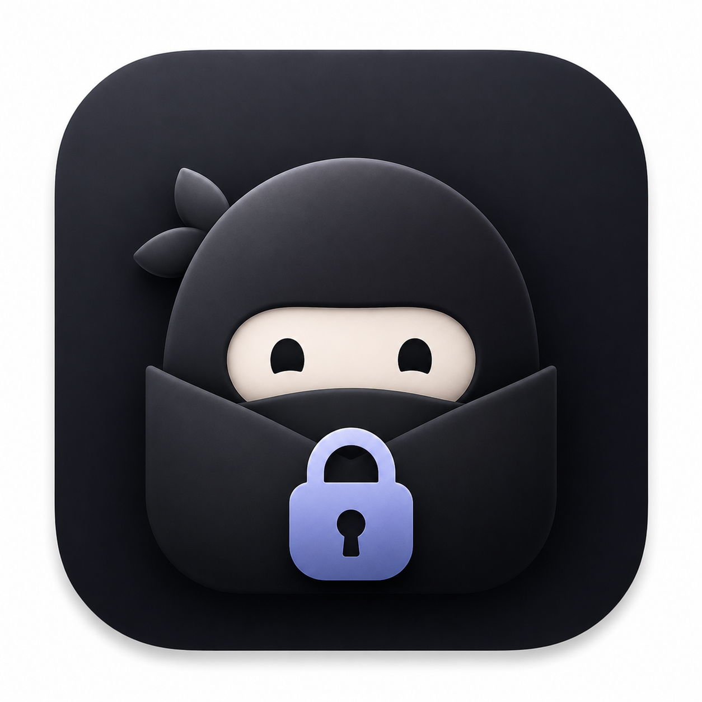
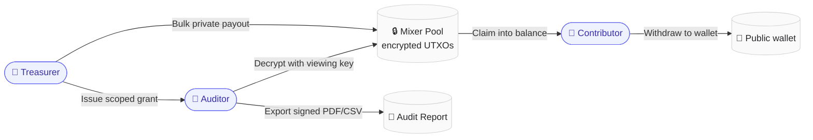
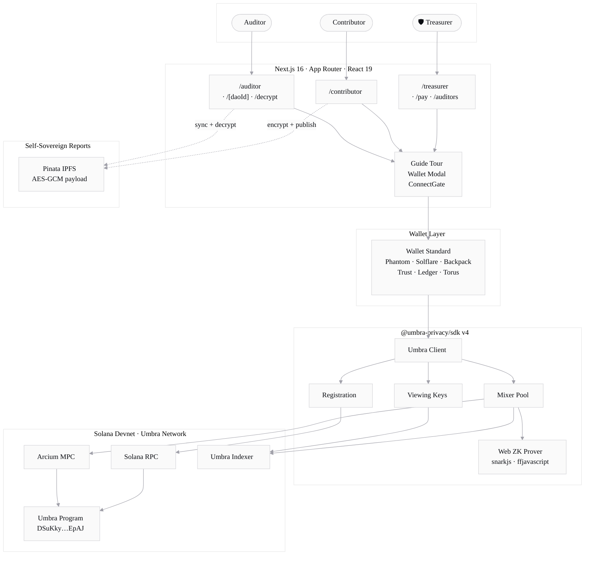
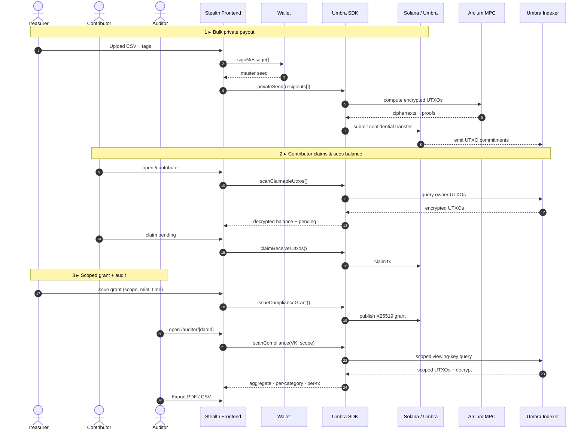
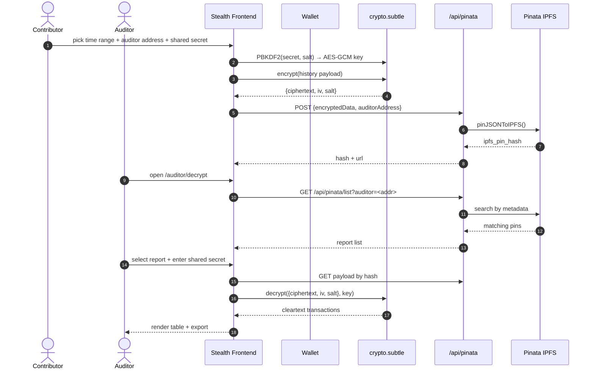
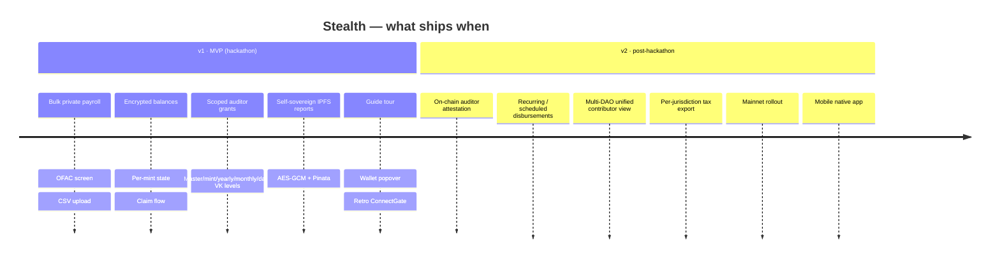

<div align="center">

  

  # Stealth

  **Private payroll for modern teams — built on Umbra, native to Solana.**

  *Encrypted by default. Auditable on demand.*

  [](https://superteam.fun/earn/listing/umbra-side-track)
  [](https://solana.com)
  [](https://nextjs.org)
  [](https://www.typescriptlang.org)
  [](https://tailwindcss.com)
  [](#license)

  [Live demo](#-demo) · [Quick start](#-quick-start) · [Architecture](#-architecture) · [How it works](#-how-it-works)

</div>

---

## Table of Contents

- [Why Stealth](#-why-stealth)
- [The trilemma](#-the-trilemma)
- [Three roles, one platform](#-three-roles-one-platform)
- [Feature matrix](#-feature-matrix)
- [Architecture](#-architecture)
- [How it works](#-how-it-works)
- [Umbra primitives in use](#-umbra-primitives-in-use)
- [Tech stack](#-tech-stack)
- [Project structure](#-project-structure)
- [Quick start](#-quick-start)
- [Environment](#-environment)
- [Scripts](#-scripts)
- [Roadmap](#-roadmap)
- [License](#-license)

---

## ✦ Why Stealth

DAO treasuries are stuck between two bad defaults: **fully public** (Realms, Squads) where every salary is permanently visible on Solscan, or **fully anonymous** (Tornado-style mixers) which destroys auditability and locks out institutional capital.

Stealth provides the missing third option — **private by default, auditable on demand** — by layering compliance-grade selective disclosure on top of the [Umbra SDK](https://sdk.umbraprivacy.com/introduction).

> The cryptography is Umbra's. The product surface for treasurers, contributors, and auditors is Stealth's.

---

## ✦ The trilemma

```mermaid
%%{init: {'theme':'base','themeVariables':{'primaryColor':'#eef2ff','primaryBorderColor':'#6366f1','primaryTextColor':'#0b0d12','lineColor':'#9ca3af'}}}%%
quadrantChart
    title DAO Payroll Tooling Landscape
    x-axis Public --> Confidential
    y-axis Un-auditable --> Auditable
    quadrant-1 Stealth
    quadrant-2 Realms / Squads / Streamflow
    quadrant-3 Tornado-style mixers
    quadrant-4 (impossible without Umbra)
    Realms: [0.15, 0.85]
    Streamflow: [0.20, 0.78]
    Toku: [0.25, 0.70]
    Tornado-style: [0.85, 0.10]
    Stealth: [0.85, 0.90]
```

**Status quo A** leaks burn rate, comp tables, and vendor relationships. **Status quo B** trades transparency for regulatory exposure. Stealth resolves the trilemma cryptographically: encrypted balances on-chain, scoped read-only viewing keys for auditors.

---

## ✦ Three roles, one platform



| Role | Surface | Core capability |
|---|---|---|
| **Treasurer** | `/treasurer` | Bulk payouts (CSV), OFAC screening, auditor grant lifecycle |
| **Contributor** | `/contributor` | Encrypted balance, claim UTXOs, withdraw, self-sovereign reports |
| **Auditor** | `/auditor` | Receive grants, decrypt scoped views, sync IPFS reports, export PDF/CSV |

---

## ✦ Feature matrix

<table>
  <tr>
    <td width="33%" valign="top">

**🔐 Treasurer**

- CSV bulk private send
- Wrap SOL → WSOL inline
- OFAC sanctions screening
- Multisig + single-sig flow
- Scoped auditor grants (master · mint · yearly · monthly · daily)
- Revoke grants on-chain
- Master Viewing Key derivation

    </td>
    <td width="33%" valign="top">

**💼 Contributor**

- Encrypted token accounts
- Claim pending UTXOs
- Withdraw to any wallet
- Per-mint balances (SOL · USDC)
- Self-sovereign compliance reports
- IPFS publish via Pinata
- AES-GCM E2E encryption

    </td>
    <td width="33%" valign="top">

**🔎 Auditor**

- Active grants dashboard
- Scoped compliance scanner
- TVK descent (mint/year/month)
- Recipient filter + search
- Indexer + MPC progress meter
- PDF + CSV report export
- IPFS report decrypt page

    </td>
  </tr>
</table>

Plus an in-app **guided tour** (role-aware, 7–8 steps), a **retro CRT ConnectGate**, a **two-pane wallet modal** (RainbowKit-style), and a **light premium design system** built on Tailwind v4 + Framer Motion + GSAP.

---

## ✦ Architecture

A client-side Next.js app that talks directly to the Umbra SDK from the browser. No proprietary backend, no central DB — authoritative state lives on-chain via Umbra. Pinata is used only for self-sovereign IPFS reports (encrypted client-side).



### Key boundaries

| Boundary | Rule |
|---|---|
| **Identity** | Wallet signature. No emails, no accounts, no auth backend. |
| **Master seed** | Derived per session via `signMessage(UMBRA_MESSAGE_TO_SIGN)`. Never persisted. |
| **State** | On-chain via Umbra. `localStorage` only for UI cache (claimed UTXO indices, compliance grants metadata). |
| **Reports** | AES-GCM encrypted client-side, addressed to auditor wallet, stored on IPFS via Pinata. |
| **Network** | SDK resolves program ID per network — devnet → mainnet is a config flip. |

---

## ✦ How it works

### Treasurer → Contributor → Auditor canonical flow



### Self-sovereign IPFS report (contributor → auditor)



---

## ✦ Umbra primitives in use

| Primitive | Wrapper module | Stealth surface |
|---|---|---|
| **Encrypted Token Accounts** | `lib/umbra/balance.ts` | Contributor balances · per-mint state machine (`shared`/`mxe`/`uninitialized`) |
| **Mixer Pool (UTXOs)** | `lib/umbra/transfers.ts` · `claim.ts` | Bulk private payouts · receiver claim flow |
| **X25519 Compliance Grants** | `lib/umbra/compliance.ts` | Issue/revoke scoped auditor access · localStorage grants store |
| **Mixer Pool Viewing Keys** | `lib/compliance/*` | TVK descent (`tvk.ts`) · indexer scanner · anchor-event decode |
| **Web ZK Prover** | `lib/umbra/prover.ts` | Snarkjs proof generation for registration & transfers |
| **Withdraw (two-step)** | `lib/umbra/withdraw.ts` | Queue tx + Arcium callback w/ `callbackStatus` surface |

> **Why Umbra is essential, not optional.** Strip Umbra and Stealth collapses into a worse Streamflow: public ledger, leaked comp tables, no compliance story. Every flow bottoms out in an SDK call.

---

## ✦ Tech stack

<table>
<tr><td width="180"><b>Framework</b></td><td>Next.js <code>16.2.4</code> · App Router · React <code>19</code> · TypeScript strict</td></tr>
<tr><td><b>Styling</b></td><td>Tailwind CSS <code>v4</code> · CSS-first <code>@theme inline</code> · zero CSS-in-JS</td></tr>
<tr><td><b>Motion</b></td><td>Framer Motion · GSAP · IntersectionObserver-based <code>Reveal</code></td></tr>
<tr><td><b>Icons</b></td><td>Lucide React · inline SVG primitives</td></tr>
<tr><td><b>Wallets</b></td><td>Wallet Standard auto-detect + explicit adapters (Phantom · Solflare · Backpack · Trust · Ledger · Torus)</td></tr>
<tr><td><b>Solana</b></td><td><code>@solana/kit</code> · <code>@solana/web3.js</code></td></tr>
<tr><td><b>Privacy</b></td><td><code>@umbra-privacy/sdk</code> v4 · <code>@umbra-privacy/web-zk-prover</code> · <code>@umbra-privacy/umbra-codama</code></td></tr>
<tr><td><b>Cryptography</b></td><td><code>snarkjs</code> · <code>ffjavascript</code> · WebCrypto (AES-GCM · PBKDF2)</td></tr>
<tr><td><b>Data</b></td><td>Papaparse (CSV) · jsPDF (audit reports) · Pinata (IPFS pin/list)</td></tr>
<tr><td><b>Deployment</b></td><td>Vercel · Solana devnet</td></tr>
</table>

---

## ✦ Project structure

```
stealth-fe/
├── app/
│   ├── page.tsx                    # Landing
│   ├── welcome/                    # Role chooser
│   ├── treasurer/                  # Dashboard · /pay · /auditors
│   ├── contributor/                # Balance · withdraw · IPFS report
│   ├── auditor/                    # Grants list · /[daoId] · /decrypt
│   ├── api/pinata/                 # /upload · /list (Pinata proxy)
│   ├── icon.tsx                    # Dynamic favicon (ImageResponse)
│   └── globals.css                 # Design tokens + keyframes
│
├── components/
│   ├── landing/                    # Hero · Features · Umbra · CTA · Footer …
│   ├── app/                        # AppNav · WalletButton · WalletModal
│   │                               # ConnectGate · GuideTour · RegistrationBanner
│   └── ui/                         # flow-button · 404-error-page (retro TV)
│
├── lib/
│   ├── umbra/                      # SDK wrappers — client · registration
│   │                               # transfers · balance · claim · compliance
│   │                               # withdraw · prover · signer
│   ├── compliance/                 # Auditor scanner pipeline
│   │                               # indexer · rpc · anchor-events
│   │                               # buffer-pda · tvk · scanner · types
│   ├── csv.ts                      # Papaparse wrapper
│   ├── pdf.ts                      # jsPDF audit report builder
│   ├── grants-store.ts             # localStorage CRUD for grants
│   ├── constants.ts                # RPC URLs · known mints · network
│   └── types.ts                    # Shared TS types
│
├── hooks/
│   ├── useRegistration.ts          # Umbra registration state machine
│   └── useGsap.ts                  # GSAP timeline helpers
│
├── context/
│   ├── WalletProvider.tsx          # @solana/wallet-adapter-react
│   ├── UmbraContext.tsx            # Single Umbra client instance
│   └── ToastContext.tsx            # Toast queue
│
└── public/
    ├── stealth_logo.png
    └── icon-robot.png
```

---

## ✦ Quick start

### Prerequisites

- **Node.js** ≥ 20
- **npm** (or pnpm / yarn)
- A wallet that supports the Solana Wallet Standard — [Phantom](https://phantom.app), [Solflare](https://solflare.com), or Backpack
- **Devnet SOL** — [faucet.solana.com](https://faucet.solana.com)

### Install & run

```bash
git clone https://github.com/Stefaron/Stealth-Frontier-Hackathon.git
cd Stealth-Frontier-Hackathon/stealth-fe
npm install
npm run dev
```

App at <http://localhost:3000>.

### Try the three roles

1. **Treasurer** → `/welcome` → Treasurer → upload CSV (see `lib/csv.ts` for format) → sign & send
2. **Contributor** → `/welcome` → Contributor → connect a recipient wallet → claim pending UTXOs
3. **Auditor** → `/welcome` → Auditor → receive grant from treasurer → open report → export PDF

> **First time?** The in-app **Guide** button walks you through every role in under a minute.

---

## ✦ Environment

`stealth-fe/.env.local`:

```env
# Solana network (devnet | mainnet | localnet)
NEXT_PUBLIC_SOLANA_NETWORK=devnet
NEXT_PUBLIC_SOLANA_RPC_URL=https://api.devnet.solana.com
NEXT_PUBLIC_SOLANA_WS_URL=wss://api.devnet.solana.com

# Umbra
NEXT_PUBLIC_UMBRA_RELAYER_URL=https://relayer-dev.umbraprivacy.com
NEXT_PUBLIC_UMBRA_INDEXER_URL=https://utxo-indexer.api-devnet.umbraprivacy.com

# Pinata (for self-sovereign IPFS reports)
PINATA_JWT=<your-jwt>
```

### Umbra program IDs

| Network | Program ID |
|---|---|
| **Devnet** | `DSuKkyqGVGgo4QtPABfxKJKygUDACbUhirnuv63mEpAJ` |
| **Mainnet** | `UMBRAD2ishebJTcgCLkTkNUx1v3GyoAgpTRPeWoLykh` |

---

## ✦ Scripts

```bash
npm run dev      # Next.js dev server (webpack)
npm run build    # Production build
npm run start    # Serve production build
npm run lint     # ESLint
npx tsc --noEmit # Type-check
```

---

## ✦ Roadmap



---

## ✦ Demo

Demo flow (≤ 60 seconds):

1. **Treasurer** — Mira pays 23 contributors privately. One click, encrypted on-chain.
2. **Auditor (Hacken)** — Logs in, sees Q1 aggregate report. Sanctions screened. No salaries leaked.
3. **Drill-down** — Auditor needs engineering category detail. Treasurer grants scoped access. 12 transactions visible, recipients still encrypted.

> *Built on Umbra. Private by default. Auditable on demand.*

---

## ✦ License

MIT — see [`LICENSE`](./LICENSE).

---

## ✦ Acknowledgements

- **[Umbra Privacy](https://www.umbraprivacy.com/)** — for the privacy infrastructure this product is impossible without.
- **[Solana Frontier Hackathon 2026](https://superteam.fun/earn/listing/umbra-side-track)** & the Umbra Side Track team.
- Design language inspired by [Linear](https://linear.app), [Vercel](https://vercel.com), and [21st.dev](https://21st.dev).

<div align="center">

  <br/>

  **Stealth** · Private by default · Auditable on demand

  [Repository](https://github.com/Stefaron/Stealth-Frontier-Hackathon) · [Umbra SDK](https://sdk.umbraprivacy.com/introduction) · [Solana](https://solana.com)

</div>
