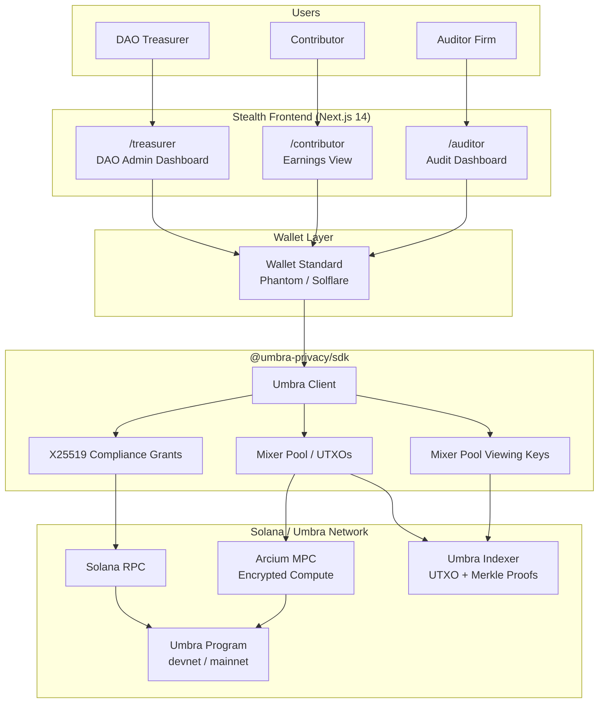
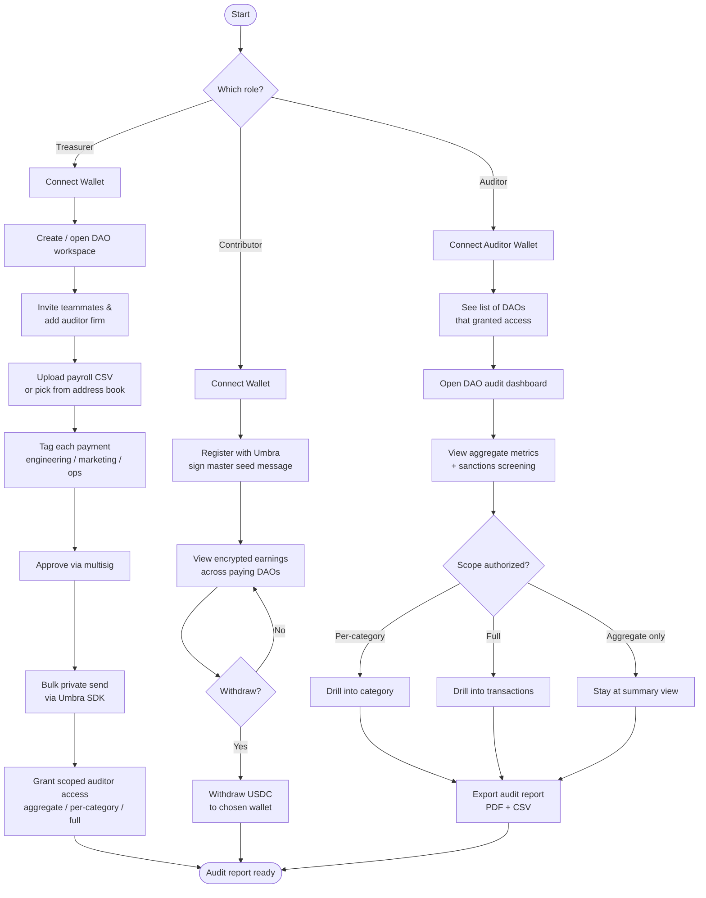
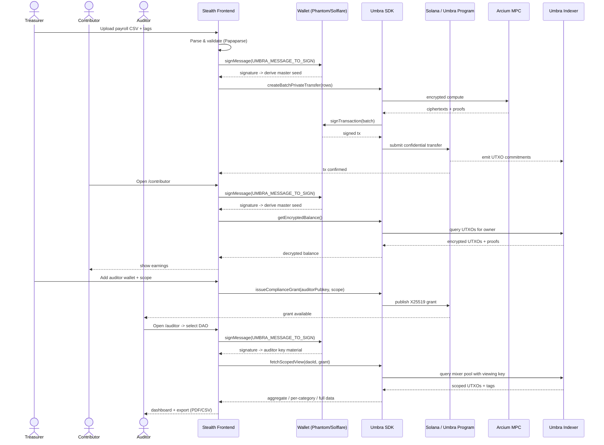

# Stealth

**Private payroll with built-in compliance for DAO auditors.**

> Where DAO treasuries stay private, and audits stay possible.

Built for the **Umbra Side Track — Solana Frontier Hackathon 2026**.

---

## Overview

Stealth is a **three-sided privacy and compliance platform** that lets DAOs on Solana run their payroll confidentially while still being able to satisfy auditors, accountants, and regulators on demand.

Today, DAO treasuries operate in two extremes: fully transparent (Realms, Squads) — where every salary, vendor payment, and burn-rate signal is broadcast to competitors and contributors alike — or fully anonymous (Tornado-style mixers) — which destroys auditability and exposes the DAO to AML and sanctions risk. Neither option is viable for a serious organization.

Stealth resolves that trilemma by being the application layer on top of the **Umbra SDK**: a privacy infrastructure built natively for Solana that supports confidential transfers, encrypted balances, and selectively disclosable viewing keys. With Umbra as the cryptographic engine, Stealth turns "compliance-ready privacy" into a real product DAO treasurers, contributors, and auditing firms can actually use.

In short: **private by default, auditable on demand.**

---

## Problem Statement

DAOs on Solana face an unsolved trilemma when paying contributors:

| Status Quo A — Realms / Squads        | Status Quo B — Tornado-style Mixers          |
| ------------------------------------- | -------------------------------------------- |
| Fully audit-friendly                  | Not auditable                                |
| Every salary public on Solscan        | Total anonymity                              |
| Burn rate, vendor invoices all leak   | Regulatory risk (AML, OFAC, sanctions)       |
| Talent retention problem              | Cannot accept institutional capital          |

The consequences are concrete:

- **Talent leaves.** Senior contributors will not accept comp packages that are permanently visible to anyone with a block explorer.
- **Strategy leaks.** Competitors can derive runway, hiring velocity, vendor relationships, and category-level spend from raw on-chain data.
- **Institutional capital stays out.** Funds and partners that need verifiable books cannot work with treasuries that operate inside opaque mixers.
- **Regulators have no good answer.** "Trust us, it's private" is not a compliance posture.

No serious DAO wants to be 100% public *or* 100% anonymous. They need an option that does not currently exist: **private by default, auditable on demand.**

---

## Solution

Stealth is built on a simple thesis: **privacy and compliance are not opposites — they are the same product, gated by selective disclosure.**

We deliver this through a **three-sided platform**, each surface designed for a distinct role:

### 1. DAO Treasurer (the payer)
Pays contributors and vendors privately. Salaries, invoices, and internal spend patterns stop being public broadcasts. Bulk disbursements are signed and submitted through Umbra's confidential transfer rails.

### 2. Contributor (the payee)
Receives USDC into an **encrypted balance**. Their financial life stops appearing on Solscan. They can withdraw to any wallet, anytime — no education burden, minimal surface area by design.

### 3. Auditor (the differentiator)
A third-party firm gets a **role-based, scoped, time-bounded dashboard** granted directly by the DAO. They can produce industry-standard audit reports — aggregate metrics, per-category drilldowns, compliance flags, sanctions screening — **without** the DAO ever having to make its books public.

This three-sided design is what makes Stealth defensible. Anyone can build "private payroll." The **auditor compliance layer**, built on Umbra's X25519 compliance grants and mixer-pool viewing keys, is what no one else can ship — and it is exactly the use case Umbra's privacy primitives were designed to enable.

### Why this fits the Umbra Side Track

- **Compliance-ready privacy, not absolute privacy** — aligns 100% with Umbra's positioning.
- **Cannot be built without Umbra** — public-ledger competitors (Request Finance, Toku, Streamflow) structurally cannot offer this.
- **Exercises every major primitive in the Umbra SDK** — the project is a working showcase, not a superficial wrapper.

---

## Key Features

- **Bulk Private Payroll** — Upload a CSV of recipients, amounts, and category tags, and disburse to all of them in one confidential batch. Treasurers get spreadsheet-grade ergonomics; the chain sees noise.
- **Encrypted Contributor Balances** — Contributors receive USDC into an Umbra-encrypted token account. Balances are decryptable only by the holder, not by Solscan, employers, or competing DAOs.
- **Transaction Tagging** — Treasurers tag each disbursement (engineering, marketing, ops, vendor, grant, etc.). Tags become the foundation of category-level audit views.
- **Scoped Auditor Access** — DAOs grant auditors access at one of three scopes — **Aggregate**, **Per-Category**, or **Full** — with optional time bounds and one-click revocation. Powered by Umbra's X25519 compliance grants.
- **Auditor Dashboard** — Aggregate metrics (total disbursement, recipient count, category breakdown), sanctions screening status, per-category drilldowns where authorized, and per-transaction detail when fully scoped.
- **Compliance Flags** — Surfaces outliers, unusual patterns, and OFAC screening results so auditors can sign off with a real workpaper trail.
- **Audit Report Export** — One-click PDF and CSV export shaped like the workpapers external auditors already produce, so adoption requires zero workflow change.
- **Wallet-Native Auth** — No accounts, no passwords. Wallet signature *is* the identity, for treasurers, contributors, and auditors alike.
- **Devnet-First, Mainnet-Ready** — Fully functional on Solana devnet for the hackathon, architected to flip to mainnet without code changes (the Umbra SDK resolves program IDs by network).

---

## Umbra / Frontier Integration

Stealth is not a product that *uses* Umbra — it is a product that **only exists because Umbra exists**. Every core flow in the application bottoms out in an Umbra SDK call, and the auditor surface is a direct consumer of two Umbra primitives that have no equivalent anywhere else in the Solana ecosystem.

### How Stealth uses the Umbra SDK

| Umbra Primitive             | Stealth Surface                                | Why it matters                                                            |
| --------------------------- | ---------------------------------------------- | ------------------------------------------------------------------------- |
| **Encrypted Token Accounts** | Contributor balances                          | Salaries stop being public — the foundation of the entire product         |
| **Mixer Pool (UTXOs)**      | DAO → Contributor bulk payroll transfers       | Unlinkable transfers; competitors cannot reconstruct comp tables          |
| **X25519 Compliance Grants** | Auditor onboarding & scope management         | The DAO, not Umbra, decides who sees what — privacy is *grantable*        |
| **Mixer Pool Viewing Keys** | Auditor query and report generation            | Auditors decrypt only what they were granted — selective disclosure       |

### Why Umbra is essential, not optional

- **Public-ledger payroll competitors structurally cannot replicate this.** Request Finance, Toku, Streamflow all settle in the clear. Without Umbra's confidential transfers, "private payroll" is a marketing claim, not a guarantee.
- **The auditor experience requires viewing keys.** No auditor will sign a report based on opaque mixer outputs. Umbra's viewing-key model is the exact mechanism that makes audit attestation possible without breaking privacy for everyone else.
- **Compliance is a primitive, not a feature.** Umbra's X25519 compliance grants let us express scoped access (aggregate / per-category / full) cryptographically, not just in application logic. That makes the access model trustworthy by construction.
- **Solana-native.** The product is a Solana product because Umbra is a Solana primitive. Latency, cost, and UX of confidential payroll are only practical on Solana.

### Components that touch Umbra directly

- `lib/umbra/client.ts` — single Umbra client instance, network-resolved (devnet / mainnet).
- `lib/umbra/registration.ts` — wraps Umbra registration; gates all deposit and transfer flows.
- `lib/umbra/transfers.ts` — bulk private send through the mixer pool; consumes parsed CSV batches.
- `lib/umbra/balance.ts` — decrypts and reads contributor encrypted balances.
- `lib/umbra/compliance.ts` — issues X25519 compliance grants to auditor wallets and revokes them.
- `lib/umbra/auditor.ts` — uses mixer-pool viewing keys to materialize aggregate, per-category, and per-transaction views for the auditor dashboard.

### How the Umbra Side Track expectations are met

- **Real utility, not a demo skin** — payroll is a recurring, high-volume B2B use case with clear willingness to pay.
- **Solves a problem people have today** — every operational DAO already feels the public-treasury pain.
- **Fundamentally relies on the SDK** — remove Umbra and the product collapses to a worse version of Streamflow.
- **Innovative use** — selective disclosure to a *third-party auditor role* is a category that does not exist in the rest of Solana payroll/treasury tooling.

---

## Architecture

Stealth is a Next.js 14 application that talks directly to the Umbra SDK from the client. There is no proprietary backend database — state lives on-chain (via Umbra) plus a thin client-side cache for UX. Optional non-sensitive metadata (DAO display name, auditor invite emails) lives in a lightweight key/value store.

### High-Level Architecture



### Architectural notes

- **Frontend.** Next.js 14 App Router. Server components handle CSV parsing and PDF generation; client components own wallet interactions and Umbra SDK calls that require user-held secrets.
- **Auth.** None — wallet signature is the identity. Each role (`/treasurer`, `/contributor`, `/auditor`) gates by the connected wallet and on-chain Umbra grants.
- **Privacy boundary.** Master seeds are derived per-session from `wallet.signMessage(UMBRA_MESSAGE_TO_SIGN)` and never persisted. Viewing keys are never embedded in URLs or logs.
- **Storage.** No proprietary DB. Authoritative state lives on-chain via Umbra. A lightweight KV store may hold non-sensitive metadata (DAO display name, auditor invite email) only.
- **Network.** Devnet for the hackathon submission; the SDK resolves the correct program ID by `network` parameter so a mainnet flip is configuration, not refactor.

---

## User Flow

The diagram below traces the canonical end-to-end story across all three roles, ending in the auditor producing a signed report — the moment that proves the entire system works.



---

## How It Works

### Technical Flow — Bulk Private Payroll with Auditor Disclosure

The sequence below is the central technical loop of Stealth: a treasurer issues a confidential batch payment, contributors see encrypted balances they alone can decrypt, and a granted auditor later materializes a scoped, decrypted view for their report.



### Key behaviors worth calling out

- **Master seed is ephemeral.** Re-derived per session via `signMessage`. Never written to disk, localStorage, or any URL.
- **Registration is required** before a wallet can deposit, transfer, or receive. The UI gates this explicitly.
- **MPC has latency.** Arcium computes off-chain. Loading and retry states are first-class UI concerns, not afterthoughts.
- **Wallets must support both `solana:signTransaction` and `solana:signMessage`.** If either feature is missing, Stealth fails fast with a clear error.
- **Encrypted balance ≠ on-chain balance.** Reading any balance requires decryption with the holder's master seed — there is no "admin view."

---

## Tech Stack

| Layer        | Tool                  | Notes                                                              |
| ------------ | --------------------- | ------------------------------------------------------------------ |
| Frontend     | Next.js 14 (App Router) | Server components for CSV/PDF, client components for wallet & SDK |
| Language     | TypeScript            | Strict mode                                                        |
| Styling      | Tailwind CSS          | No CSS-in-JS                                                       |
| Wallet       | Wallet Standard       | Phantom, Solflare                                                  |
| Solana SDK   | `@solana/kit`         | Modern Solana TS library                                           |
| Privacy      | `@umbra-privacy/sdk`  | The whole reason this product exists                               |
| CSV          | Papaparse             | Browser-side parsing                                               |
| PDF          | `react-pdf` / `jsPDF` | Audit report export                                                |
| Deployment   | Vercel                |                                                                    |
| Network      | Solana **devnet**     | Mainnet flip is a config change post-MVP                           |

---

## Getting Started

### Prerequisites

- **Node.js** 20.x or later
- **pnpm** 9.x (or npm / yarn — examples use pnpm)
- A Solana wallet that supports the Wallet Standard (**Phantom** or **Solflare** recommended)
- Some **devnet SOL** in your wallet — request from <https://faucet.solana.com>

### 1. Clone and install

```bash
git clone https://github.com/<your-org>/stealth.git
cd stealth
pnpm install
```

### 2. Configure environment

Copy the example env file and fill in the values:

```bash
cp .env.example .env.local
```

```env
# .env.local
NEXT_PUBLIC_SOLANA_NETWORK=devnet
NEXT_PUBLIC_SOLANA_RPC_URL=https://api.devnet.solana.com
NEXT_PUBLIC_UMBRA_NETWORK=devnet
```

> The Umbra SDK resolves its program ID automatically from `NEXT_PUBLIC_UMBRA_NETWORK`. Switch to `mainnet` only after verifying flows on devnet.

### 3. Run locally

```bash
pnpm dev
```

The app is now available at <http://localhost:3000>.

### 4. Try the three roles

- `http://localhost:3000/treasurer` — create a DAO workspace, upload the sample CSV in `/fixtures/payroll-sample.csv`, tag categories, and send a bulk confidential payment.
- `http://localhost:3000/contributor` — connect a recipient wallet from the CSV and view your decrypted balance.
- `http://localhost:3000/auditor` — connect an auditor wallet that the treasurer granted access to, open the DAO, and export an aggregate or per-category audit report.

### 5. Test

```bash
pnpm test          # unit tests
pnpm test:e2e      # Playwright end-to-end against devnet
pnpm typecheck     # tsc --noEmit
pnpm lint          # eslint
```

### 6. Build for production

```bash
pnpm build
pnpm start
```

For one-click deployment, push to a Vercel project and set the env vars listed above.

---

## Project Structure

```
/app
  /treasurer        — DAO admin pages
  /contributor      — Contributor earnings pages
  /auditor          — Auditor dashboard pages
  /api              — Next.js API routes (only where needed)
/components
  /ui               — Reusable primitives (shadcn/ui-style)
  /treasurer        — Treasurer-specific components
  /contributor      — Contributor-specific components
  /auditor          — Auditor-specific components
/lib
  /umbra            — Umbra SDK wrappers (client, registration, transfers, compliance, auditor)
  /utils            — Pure functions (CSV parsing, formatters, validators)
/types              — Shared TypeScript types (PaymentBatch, AuditScope, etc.)
/fixtures           — Sample CSVs and fixture data for local demos
```

---

## Deployed Program IDs

Stealth does not deploy its own on-chain program — privacy is delegated to the Umbra program, which the SDK targets automatically per network.

| Network  | Umbra Program ID                                   |
| -------- | -------------------------------------------------- |
| Devnet   | `DSuKkyqGVGgo4QtPABfxKJKygUDACbUhirnuv63mEpAJ`     |
| Mainnet  | `UMBRAD2ishebJTcgCLkTkNUx1v3GyoAgpTRPeWoLykh`     |

Frontend deployment URL and demo video link will be added to this section ahead of submission.

---

## Demo

A short demo video (under 5 minutes) walks through:

1. **Treasurer view** — Mira, treasurer of a sample DAO, pays 23 contributors in a single confidential batch with category tags.
2. **Contributor view** — A contributor wallet opens its earnings page and sees an encrypted USDC balance only they can decrypt.
3. **Auditor view** — A granted auditor firm logs in, views the aggregate report, drills into the engineering category under a scoped grant, and exports a PDF audit report. No individual salaries are leaked outside the granted scope.

> *Built on Umbra. Private by default. Auditable on demand.*

---

## Roadmap (post-hackathon)

The MVP is intentionally narrow. The following are explicit v2+ items, not promises:

- On-chain audit attestation signed by the auditor's wallet
- Recurring / scheduled disbursements
- Multi-DAO unified contributor view
- Tax-reporting export per jurisdiction
- On/off-ramp integration
- Mainnet rollout once devnet is fully battle-tested

---

## License

MIT — see [`LICENSE`](./LICENSE).

---

## Acknowledgements

- **Umbra Privacy** — for shipping the privacy infrastructure that makes confidential, compliance-grade payroll on Solana possible. Docs: <https://sdk.umbraprivacy.com/introduction>
- **Solana Frontier Hackathon 2026** organizers and the **Umbra Side Track** team.
