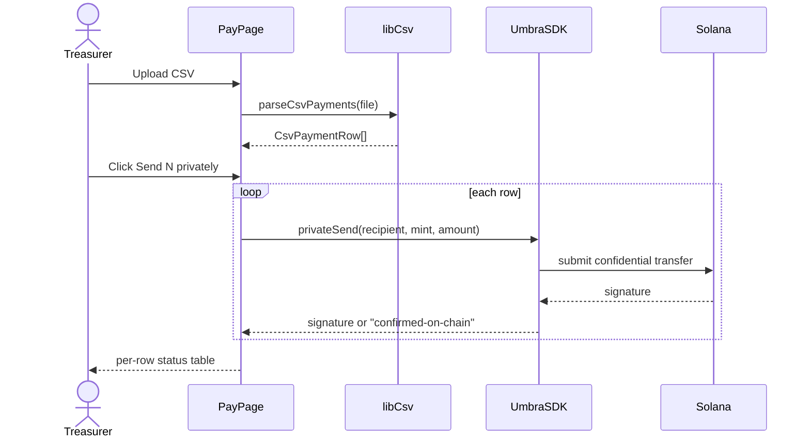
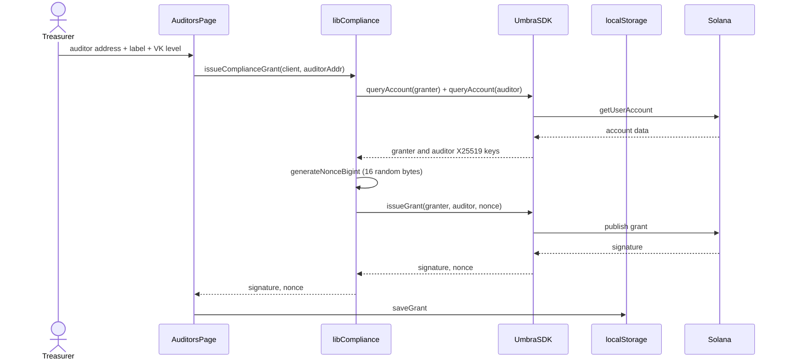
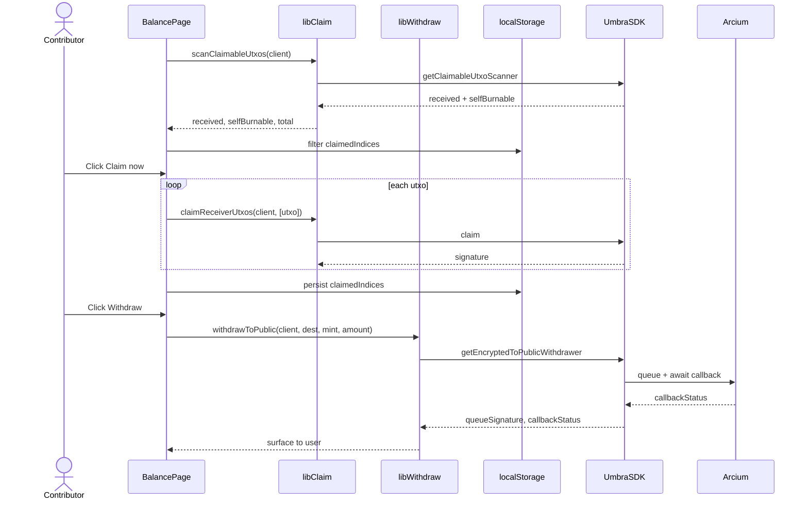
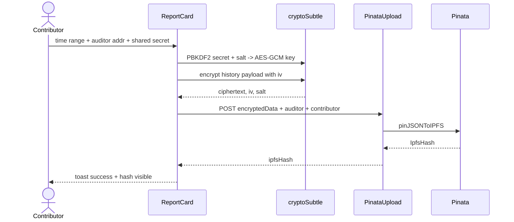
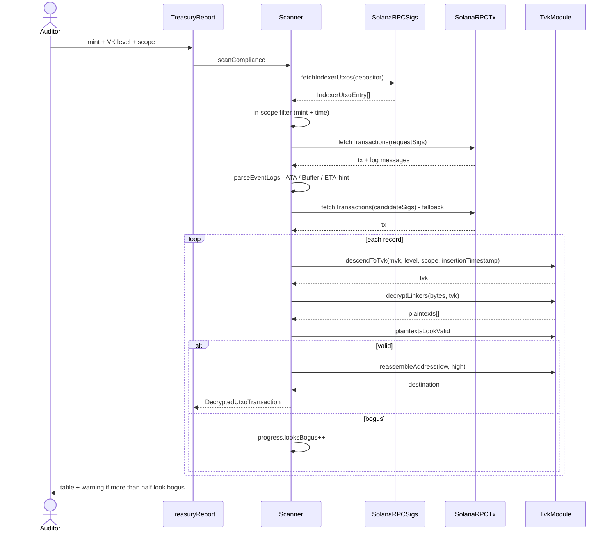
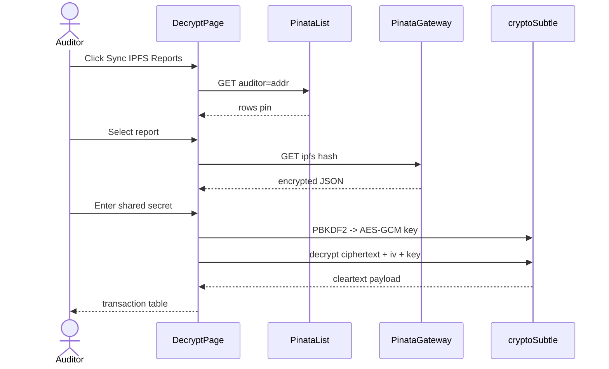

# API & Data Flow

> How data moves through Stealth — from a click in the browser, to the Umbra SDK, to Solana, and out to IPFS via Pinata. Plus the internal API surface.

---

## Table of Contents

- [Data philosophy](#data-philosophy)
- [State sources](#state-sources)
- [Internal API routes (Next.js)](#internal-api-routes-nextjs)
- [External integrations](#external-integrations)
- [Per-role data flow](#per-role-data-flow)
- [Error & loading state](#error--loading-state)
- [Auth & session](#auth--session)

---

## Data philosophy

Stealth was designed with no application database. The reason isn't minimalism — it's product positioning:

> *If privacy comes from a server, the server is the single point of failure. Stealth moves privacy into the user's wallet, so the server has nothing to leak.*

Authoritative state lives in three places:

| Place | Contents |
|---|---|
| **Solana on-chain** | UTXOs, encrypted balances, X25519 grants, account registrations. |
| **The user's wallet** | The signature that derives the master seed. |
| **localStorage in the browser** | UI cache (claimed indices), grant metadata (issuer/auditor/nonce/label), preferences (preferred wallet, guide-seen flags). |

The Next.js backend is **only** used to proxy Pinata for the self-sovereign report — and even then, the ciphertext is already encrypted before it leaves the browser.

---

## State sources

### React Context

| Context | What it stores | File |
|---|---|---|
| `WalletProvider` | `wallet`, `wallets`, `publicKey`, `connected`, plus `select / connect / disconnect` actions. | `context/WalletProvider.tsx` |
| `UmbraContext` | `client: IUmbraClient \| null`, `isInitializing`, `error`, plus `initClient / clearClient`. | `context/UmbraContext.tsx` |
| `ToastContext` | A queue of `ToastItem[]` with `addToast / dismissToast`. | `context/ToastContext.tsx` |

### Custom hooks

- `useRegistration(walletAddress)` — a 6-status state machine (`idle`, `checking`, `registered`, `unregistered`, `registering`, `pending`, `error`) for Umbra registration. Detects "already processed" and "Arcium TTL timeout" so the UI doesn't show false errors.

### localStorage (per browser)

| Key | Format | Purpose |
|---|---|---|
| `stealth-wallet-name` | string | Auto-reconnect the last-used wallet in `ConnectGate`. |
| `umbra_claimed_<base58>` | JSON array of `insertionIndex` strings | Already-claimed UTXOs — prevents double-claim after refresh. |
| `stealth:compliance-grants` | JSON array of `ComplianceGrant` | All active grants (issuer, auditor, nonce, label, viewingKey hex). |
| `stealth-guide-seen-v2-treasurer` (etc.) | `"1"` | Flag indicating the tour was dismissed for that role. |

### Module-scope memory

- `indexerCache` in `lib/compliance/scanner.ts` — a `Map<depositorAddress, IndexerUtxoEntry[]>` living for the browser session. Cleared via `clearIndexerCache(addr?)`.

---

## Internal API routes (Next.js)

Only two routes — both Pinata proxies, protected by a server-side `PINATA_JWT` env that the client never sees.

### `POST /api/pinata/upload`

**File:** `app/api/pinata/upload/route.ts`

**Request body:**

```json
{
  "encryptedData": { "cipher": "AES-GCM", "ciphertext": "...", "iv": "...", "salt": "..." },
  "auditorAddress": "<base58>",
  "contributorAddress": "<base58>"
}
```

**Behavior:**
- Validates the three required fields → 400 if anything is missing.
- Validates `PINATA_JWT` env → 500 if not configured.
- Forwards to `https://api.pinata.cloud/pinning/pinJSONToIPFS` with:
  - `pinataMetadata.name` = `stealth-report-${auditorAddress.slice(0, 8)}`
  - `pinataMetadata.keyvalues.auditor` & `.contributor` = original addresses
- Returns `{ ipfsHash: <hash> }`.

**Notes:**
- The request body is **always** pre-encrypted — the server never sees the plaintext.
- The `auditor` metadata tag is what makes `/api/pinata/list` filterable.

### `GET /api/pinata/list?auditor=<base58>`

**File:** `app/api/pinata/list/route.ts`

**Query param:** `auditor` (required).

**Behavior:**
- Builds a Pinata metadata query `{ auditor: { value: <addr>, op: "eq" } }`.
- Issues a GET to `https://api.pinata.cloud/data/pinList?status=pinned&metadata[keyvalues]=<encoded>`.
- Returns `{ rows: <pin list> }`.

**Notes:**
- The returned shape is whatever Pinata returns (`ipfs_pin_hash`, `date_pinned`, `metadata.keyvalues`).
- The client then fetches the payload directly from `https://gateway.pinata.cloud/ipfs/<hash>` — no extra round trip through the API route.

---

## External integrations

### Solana Devnet RPC

| URL | Role |
|---|---|
| `NEXT_PUBLIC_SOLANA_RPC_URL` (`https://api.devnet.solana.com`) | HTTP RPC for getBalance, getSignaturesForAddress, getTransaction, etc. |
| `NEXT_PUBLIC_SOLANA_WS_URL` (`wss://api.devnet.solana.com`) | WebSocket subscriptions. |

Consumed by:
- `@solana/web3.js` `Connection` in `WalletButton` for SOL balance.
- Umbra SDK via `getUmbraClient({ rpcUrl, rpcSubscriptionsUrl })`.
- `lib/compliance/indexer.ts` and `lib/compliance/rpc.ts` for the scanner.

### Umbra Relayer

`NEXT_PUBLIC_UMBRA_RELAYER_URL` (`https://relayer-dev.umbraprivacy.com`). Used for fee-abstraction (e.g., claim relaying). Wrapped in `lib/umbra/client.ts` via `createRelayer()`.

### Umbra Indexer

`NEXT_PUBLIC_UMBRA_INDEXER_URL` (`https://utxo-indexer.api-devnet.umbraprivacy.com`). Consumed by the Umbra SDK internally — Stealth no longer calls the indexer directly (the scanner now uses `getSignaturesForAddress`).

The rewrite proxy `/proxy/data-indexer/:path*` in `next.config.ts` remains for potential future use.

### Arcium MPC

Not directly accessed. Reached through the Umbra SDK during `withdrawToPublic` (callback) and `registerUser` (X25519 anonymous activation). MPC latency on devnet can be 2–5 minutes — hence the `pending` state in `useRegistration` that waits for confirmation.

### Pinata IPFS

- **Auth:** `PINATA_JWT` (server-side only, never `NEXT_PUBLIC_*`).
- **Upload:** `https://api.pinata.cloud/pinning/pinJSONToIPFS`.
- **List:** `https://api.pinata.cloud/data/pinList`.
- **Gateway:** `https://gateway.pinata.cloud/ipfs/<hash>`.

---

## Per-role data flow

### Treasurer · Bulk Private Payout



### Treasurer · Issue Compliance Grant



### Contributor · Claim & Withdraw



### Contributor · IPFS Report



### Auditor · Treasury Report Scan



### Auditor · Sync & Decrypt IPFS Report



---

## Error & loading state

Every layer has its own convention:

| Layer | Pattern |
|---|---|
| **SDK wrapper (`lib/umbra/*`)** | Throws `Error` with localized messages. Some functions (e.g. `privateSend`) catch "already been processed" and return a placeholder signature. |
| **Hook (`useRegistration`)** | Translates errors into `"error"` or `"pending"`. Detects "Arcium TTL timeout" to avoid false negatives. |
| **Page component** | Calls `useToast()` for success / error / loading. Local `isLoading` booleans drive disabled states. |
| **API route** | Returns `NextResponse.json({ error }, { status })`. 400 for validation; 500 for server config. |

Loading state UI:
- A primary button with an inline spinner (`animate-spin`).
- A `loading` toast that doesn't auto-dismiss (manual `toast.dismiss(id)`).
- The registration banner has a `pending` state with a spinner + informative message.

---

## Auth & session

**Auth = wallet signature.** No login flow, no tokens, no cookies.

Session lifecycle:

1. The user clicks **Connect** in `WalletModal` or `ConnectGate`.
2. `useWallet().select(name)` + `connect()`.
3. `publicKey` lands in `useWallet()` state.
4. The user triggers init via the registration banner or first action. `initClient()` in `UmbraContext` builds a signer from the adapter, then `getUmbraClient(...)` performs `signMessage(UMBRA_MESSAGE_TO_SIGN)` to derive the master seed.
5. The master seed is **never** persisted. It only lives in memory for the duration of the session.
6. When `connected = false` or `publicKey` changes, `UmbraContext.useEffect` calls `clearClient()` — every Umbra state is dropped.

Refreshing the page means another signature. That's a deliberate trade-off: more signatures, more safety.

---

[← Back to index](./README.md) · [Next: Design System →](./DESIGN_SYSTEM.md)
