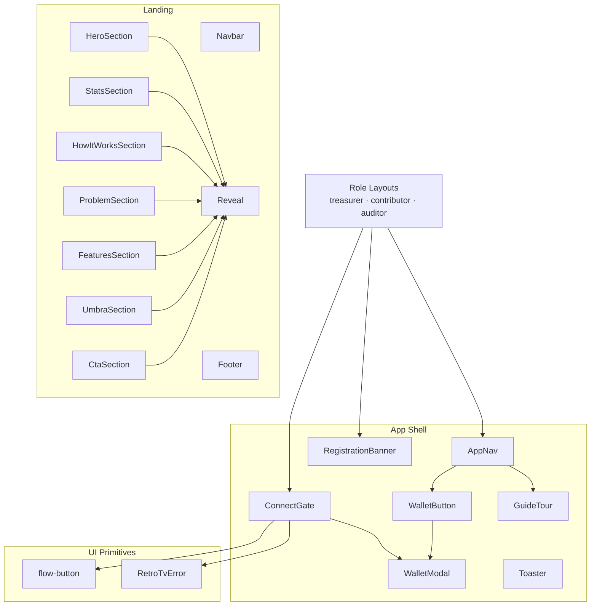

# Components

> An inventory of frontend components in `stealth-fe/components/`. Each entry lists the file, the role, important props, and relationships to other components.

---

## Table of Contents

- [Conventions](#conventions)
- [Landing components](#landing-components)
- [App shell components](#app-shell-components)
- [UI primitives](#ui-primitives)
- [Component relationships](#component-relationships)

---

## Conventions

- Client components start with `"use client"` on line one.
- Import paths use the `@/*` alias (defined in `tsconfig.json`).
- Props are typed via local `interface` or `type` declarations — no widely exported types.
- Components that participate in the guide tour expose `data-tour="<key>"` attributes for `GuideTour` to spotlight.

---

## Landing components

All under `components/landing/`. Rendered only on the `/` route.

### `Navbar.tsx`
Top nav for the landing page. Logo, section links (How it works, Features, Umbra), and a CTA to `/welcome`. Sticky with backdrop blur on scroll.

### `HeroSection.tsx`
The headline section. Large tagline, two CTAs (primary + secondary), and a visual element. Reveal animations come from `useGsapEnter` and `useGsapCharReveal` for the per-character typography effect.

### `StatsSection.tsx`
Numeric proof points (treasury exposure, leaked contributor salaries, etc.). Count-up animation driven by IntersectionObserver.

### `HowItWorksSection.tsx`
Four numbered cards: Treasurer creates → Contributor receives → DAO grants → Auditor reports. 4-column grid layout.

### `ProblemSection.tsx`
Explains the trilemma. A competitor table (Realms vs Tornado vs Stealth) or a side-by-side card layout.

### `FeaturesSection.tsx`
Feature grid (CSV bulk send, OFAC screen, multisig, IPFS report, etc.) with icon + title + description. Subtle hover states.

### `UmbraSection.tsx`
Explains the Umbra primitives Stealth uses — encrypted balances, mixer pool, X25519, viewing keys.

### `CtaSection.tsx`
Closing CTA toward `/welcome`. Gradient background and the final tagline.

### `Footer.tsx`
Compact footer: tagline, repo link, Umbra SDK link, copyright.

### `Reveal.tsx`
Reusable IntersectionObserver wrapper. Used for fade-up + slide-in patterns. Props: `delay`, `duration`, `y`, `once`.

---

## App shell components

All under `components/app/`. Mounted by every authenticated role layout.

### `AppNav.tsx`
Top nav, 58px tall, fixed positioning. The single most-rendered component.

**Props:**
```ts
interface AppNavProps {
  role: "treasurer" | "contributor" | "auditor";
  links: NavLink[];
}
```

**Mounted inside:**
- Logo + Stealth wordmark (link back to `/`).
- Role switcher dropdown (`data-tour="role-switcher"`).
- Page tabs for the current role (`data-tour="page-tabs"`, only shown when `links.length > 1`).
- **Guide** button (`data-tour="guide-button"`) → opens `GuideTour`.
- `WalletButton` (`data-tour="wallet"`).

**Notes:**
- `GUIDE_KEY = "stealth-guide-seen-v2"` per role (`-treasurer`, `-contributor`, `-auditor`).
- `buildSteps(role)` returns a different `TourStep[]` for each role.

### `WalletButton.tsx`
The pill on the right of the nav. When disconnected → a **Connect** button that opens `WalletModal`. When connected → a pill showing a shortened address + status dot.

Clicking the pill opens an account popover (RainbowKit-style):
- A circular avatar from `/icon-robot.png` with a hash-derived halo (`avatarGradient(addr)`).
- The full address (truncated, click-to-copy with green-check feedback for 1.5s).
- SOL balance (fetched via `Connection.getBalance`).
- A Solscan link (`https://solscan.io/account/<addr>?cluster=devnet`).
- Disconnect button (red on hover).

### `WalletModal.tsx`
The wallet picker, styled like RainbowKit.

**Props:**
```ts
interface WalletModalProps {
  open: boolean;
  onClose: () => void;
  onSelect: (name: string) => void;
}
```

**Internal state:**
- `mounted` — controls the portal render.
- `closing` — guards against double-close during the GSAP exit animation.
- `hovered` — the currently hovered row.
- `lastHovered` — the most recently hovered row; **never cleared**.

**Why `lastHovered` never clears:** the right pane (wallet preview) must stay mounted while the cursor moves from a left-side row to the Connect button on the right. If it unmounted on `mouseleave`, the click target would vanish before the click completes.

**EXCLUDE list:** `MetaMask` (EVM-only, not relevant here).

### `ConnectGate.tsx`
The full-page layer that replaces the content while `!publicKey`. Visually anchored by `RetroTvError`.

**Props:**
```ts
interface ConnectGateProps {
  children: React.ReactNode;
  role: "treasurer" | "contributor" | "auditor";
}
```

**framer-motion variants:**
- `containerVariants` — fade-up with `delayChildren: 0.1`, `staggerChildren: 0.1`.
- `itemVariants` — child fade-up.
- `iconVariants` — TV icon scale + rotate + hover wiggle.

If the wallet is connected but the Umbra `client` hasn't initialized yet → `children` still render (the registration banner handles init in the background).

### `GuideTour.tsx`
A tour engine built from SVG masks and a portal-rendered tooltip.

**Props:**
```ts
interface Props {
  open: boolean;
  steps: TourStep[];
  onClose: () => void;
  onComplete?: () => void;
}

interface TourStep {
  selector: string | null;   // null = intro step (no highlight target)
  title: string;
  body: ReactNode;
  position?: "auto" | "top" | "bottom";
}
```

**Features:**
- Auto-flips tooltip position based on viewport space.
- Esc + arrow keys for navigation.
- Click outside = close.
- Progress dots with `.tour-progress-dot.is-current` & `.is-done`.

### `RegistrationBanner.tsx`
Yellow banner at the top of treasurer & contributor pages. Calls `useRegistration(walletAddress)` and renders the UI per status:

- `unregistered` → **Register with Umbra** CTA.
- `registering` → spinner + "Signing & broadcasting...".
- `pending` → "Confirming on Arcium MPC..." (devnet can be slow).
- `registered` → banner disappears.

### `Toaster.tsx`
Render layer for `ToastContext`. A floating list in the bottom-right with enter / exit animations.

---

## UI primitives

Under `components/ui/`. Domain-free reusable blocks.

### `flow-button.tsx`
Rounded-pill button with animation:
- An expanding circle from right to left on hover.
- Two arrow icons that slide-cross (left absolute, right absolute).
- Props: `onClick`, `disabled`, `children`.

Used in `ConnectGate.tsx` as the "Connect Wallet" CTA.

### `404-error-page.tsx`
The `RetroTvError` component — a retro CRT screen with static + scanline animation.

**Props:**
```ts
{
  errorCode?: string;       // e.g., "OFFL", "STBY"
  errorMessage?: string;    // e.g., "STEALTH"
}
```

CSS used (in `globals.css`):
- `.retrotv-wrap`, `.retrotv-unit`, `.retrotv-body`, `.retrotv-screen`
- `.retrotv-static`, `.retrotv-scanline`
- `@keyframes retrotvStatic`, `@keyframes retrotvScan`

Used by `ConnectGate.tsx` as the main visual.

---

## Component relationships



**Reuse notes:**
- `WalletModal` is used by **both** `WalletButton` and `ConnectGate` — the same instance, different triggers.
- `Reveal` is consumed by almost every landing section.
- `RetroTvError` is only used by `ConnectGate` today but is designed generic (the `errorCode` and `errorMessage` props are customizable).

---

[← Back to index](./README.md) · [Next: API & Data Flow →](./API_AND_DATA_FLOW.md)
