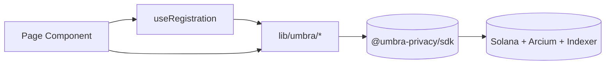
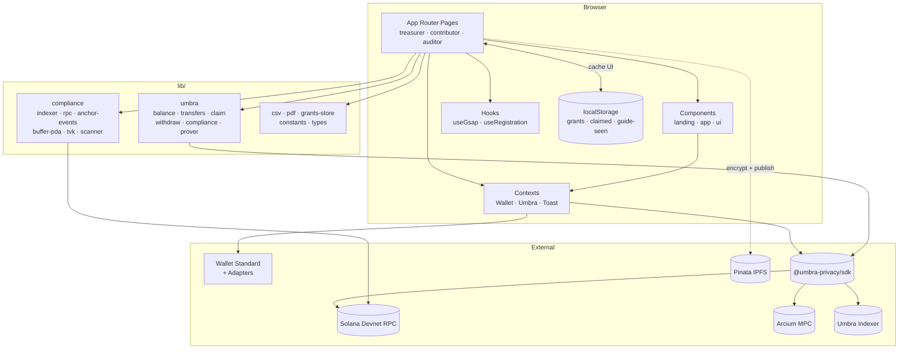

# Frontend Architecture

> The technical blueprint for the `stealth-fe` application. Written opinionated — not just **what** lives where, but **why** the structure is shaped this way.

---

## Table of Contents

- [Stack snapshot](#stack-snapshot)
- [Folder layout](#folder-layout)
- [Application entry point](#application-entry-point)
- [Routing & layout system](#routing--layout-system)
- [Component architecture](#component-architecture)
- [State management](#state-management)
- [Umbra integration layer](#umbra-integration-layer)
- [Compliance scanner pipeline](#compliance-scanner-pipeline)
- [Styling approach](#styling-approach)
- [Asset management](#asset-management)
- [Build & deployment](#build--deployment)
- [Architecture diagram](#architecture-diagram)

---

## Stack snapshot

Taken directly from `stealth-fe/package.json`:

| Category | Library | Version | Notes |
|---|---|---|---|
| Framework | `next` | `16.2.4` | App Router; dev runs with `--webpack` flag |
| UI runtime | `react` / `react-dom` | `19.2.4` | React 19 with hooks and server components |
| Styling | `tailwindcss` + `@tailwindcss/postcss` | `^4` | Tailwind v4 with `@theme inline` in `globals.css` |
| Type system | `typescript` | `^5` | Strict mode |
| Motion | `framer-motion` | `^12.38.0` | ConnectGate, WalletButton popover, and more |
| Motion | `gsap` | `^3.15.0` | Landing reveal, welcome page, wallet modal |
| Icons | `lucide-react` | `^1.14.0` | Plus inline SVG primitives |
| Wallet core | `@solana/wallet-adapter-react` | `^0.15.39` | Provider for wallet state |
| Wallet adapters | adapter-phantom · -backpack · -solflare · -trust · -ledger · -torus | various | Full list in `package.json` |
| Mobile wallet | `@solana-mobile/wallet-adapter-mobile` | `^2.2.8` | Mobile wallet adapter |
| Solana | `@solana/kit` | `^6.8.0` | Address encoders, decoders, etc. |
| Solana | `@solana/web3.js` | `^1.98.4` | Connection, balance queries |
| Privacy | `@umbra-privacy/sdk` | `^4.0.0` | Core SDK |
| Privacy | `@umbra-privacy/web-zk-prover` | `^2.0.1` | Browser-side ZK proof generation |
| Privacy | `@umbra-privacy/umbra-codama` | `^2.0.2` | Codama-generated IDL decoders |
| Crypto | `snarkjs` | `^0.7.6` | Groth16 prover |
| Crypto (transitive) | `ffjavascript` | via snarkjs | Finite field math |
| Data | `papaparse` | `^5.5.3` | Browser-side CSV parser |
| Data | `jspdf` | `^4.2.1` | PDF generation |

> **Package manager.** The presence of `stealth-fe/package-lock.json` means **npm**. Every command in these docs uses `npm`.

---

## Folder layout

```text
stealth-fe/
├─ app/                      App Router root
│  ├─ layout.tsx             Root layout — wraps the tree with providers
│  ├─ page.tsx               Landing page
│  ├─ icon.tsx               Dynamic favicon via next/og ImageResponse
│  ├─ globals.css            Tailwind v4 + design tokens + keyframes
│  │
│  ├─ welcome/
│  │  └─ page.tsx            Role chooser
│  │
│  ├─ treasurer/
│  │  ├─ layout.tsx          AppNav + ConnectGate + RegistrationBanner
│  │  ├─ page.tsx            Onboarding dashboard + action cards
│  │  ├─ pay/page.tsx        Bulk private payout
│  │  └─ auditors/page.tsx   Grant lifecycle + MVK derivation
│  │
│  ├─ contributor/
│  │  ├─ layout.tsx          AppNav + ConnectGate + RegistrationBanner
│  │  └─ page.tsx            Balance + claim + withdraw + IPFS report
│  │
│  ├─ auditor/
│  │  ├─ layout.tsx          AppNav + ConnectGate (read-only — no banner)
│  │  ├─ page.tsx            Company audits list
│  │  ├─ [daoId]/page.tsx    Treasury report (scanner + export)
│  │  └─ decrypt/page.tsx    Individual IPFS reports
│  │
│  └─ api/
│     └─ pinata/
│        ├─ upload/route.ts  POST — pin encrypted JSON to IPFS
│        └─ list/route.ts    GET  — query pins by auditor metadata
│
├─ components/
│  ├─ landing/               Landing-page sections
│  │  ├─ Navbar.tsx
│  │  ├─ HeroSection.tsx
│  │  ├─ StatsSection.tsx
│  │  ├─ HowItWorksSection.tsx
│  │  ├─ ProblemSection.tsx
│  │  ├─ FeaturesSection.tsx
│  │  ├─ UmbraSection.tsx
│  │  ├─ CtaSection.tsx
│  │  ├─ Footer.tsx
│  │  └─ Reveal.tsx          IntersectionObserver helper
│  │
│  ├─ app/                   Shared shell for authenticated areas
│  │  ├─ AppNav.tsx          Top nav + role switcher + guide trigger
│  │  ├─ WalletButton.tsx    Pill + account popover
│  │  ├─ WalletModal.tsx     Two-pane RainbowKit-style modal
│  │  ├─ ConnectGate.tsx     Retro-CRT pre-connect gate
│  │  ├─ GuideTour.tsx       SVG-mask spotlight tour
│  │  ├─ RegistrationBanner  Umbra registration status banner
│  │  └─ Toaster.tsx         Render layer for ToastContext
│  │
│  └─ ui/                    Reusable primitives
│     ├─ flow-button.tsx
│     └─ 404-error-page.tsx  RetroTvError — used by ConnectGate
│
├─ context/
│  ├─ WalletProvider.tsx     ConnectionProvider + SolanaWalletProvider
│  ├─ UmbraContext.tsx       Wraps the Umbra client for the session
│  └─ ToastContext.tsx       Toast queue
│
├─ hooks/
│  ├─ useGsap.ts             Re-exports gsap + three reveal hooks
│  └─ useRegistration.ts     State machine for Umbra registration
│
├─ lib/
│  ├─ constants.ts           Env defaults + KNOWN_MINTS
│  ├─ types.ts               Shared domain types
│  ├─ utils.ts               `cn()` helper
│  ├─ csv.ts                 parseCsvPayments + exportAuditCsv
│  ├─ pdf.ts                 generateAuditPdf + generateIncomeReportPdf
│  ├─ grants-store.ts        localStorage CRUD for grants
│  │
│  ├─ umbra/                 SDK facade
│  │  ├─ client.ts           getUmbraClient + relayer factory
│  │  ├─ signer.ts           Adapter → Umbra signer
│  │  ├─ prover.ts           Web ZK prover loaders
│  │  ├─ registration.ts     registerUser
│  │  ├─ balance.ts          Query encrypted balances + user account
│  │  ├─ transfers.ts        privateSend (CSV row → mixer pool)
│  │  ├─ claim.ts            scan + claim UTXOs (one-by-one)
│  │  ├─ withdraw.ts         withdrawToPublic with extended timeouts
│  │  └─ compliance.ts       issue + revoke compliance grant
│  │
│  └─ compliance/            Auditor scanner
│     ├─ types.ts            VkLevel, ScanScope, ScanResult, etc.
│     ├─ indexer.ts          getSignaturesForAddress wrapper
│     ├─ rpc.ts              JSON-RPC batch fetcher
│     ├─ anchor-events.ts    Decode `Program data:` logs
│     ├─ buffer-pda.ts       Derive StealthPoolDepositInputBuffer PDA
│     ├─ tvk.ts              MVK → TVK descent + Poseidon decrypt
│     └─ scanner.ts          Pipeline orchestrator
│
└─ public/
   ├─ stealth_logo.png
   └─ icon-robot.png
```

---

## Application entry point

`app/layout.tsx` is the only root layout. The structure:

```tsx
<html>
  <body className="bg-white text-[#0f1115]">
    <WalletProvider>      {/* @solana/wallet-adapter-react */}
      <UmbraProvider>     {/* Umbra client instance */}
        <ToastProvider>   {/* Toast queue */}
          {children}
          <Toaster />
        </ToastProvider>
      </UmbraProvider>
    </WalletProvider>
  </body>
</html>
```

These three providers must be ordered as above: `WalletProvider` is outermost because `UmbraProvider` needs `useWallet()`, and `ToastProvider` is innermost so anything underneath can fire toasts.

Fonts: `Geist`, `Geist Mono`, and `Playfair Display` are loaded via `next/font/google` and exposed as CSS variables (`--font-geist-sans`, `--font-geist-mono`, `--font-playfair`).

The favicon is built dynamically in `app/icon.tsx` through `ImageResponse` — the logo renders on a dark zinc background so no white halo bleeds into the browser tab.

---

## Routing & layout system

Stealth uses App Router. The three role groups — `treasurer`, `contributor`, `auditor` — each have their own `layout.tsx` that mounts:

- `AppNav` — top nav with logo, role switcher dropdown, in-role page links, Guide button, and `WalletButton`.
- `ConnectGate` — if no wallet is connected, render a retro-CRT screen with a Connect CTA and block access to `children`.
- `RegistrationBanner` *(treasurer & contributor only)* — yellow banner whenever Umbra registration is incomplete.

Route tree:

```text
/                           Landing
/welcome                    Role chooser
/treasurer                  Dashboard
/treasurer/pay              Bulk private payout
/treasurer/auditors         Manage grants
/contributor                Balance + self-sovereign report
/auditor                    Company audits list
/auditor/[daoId]            Treasury report (dynamic per DAO)
/auditor/decrypt            Individual IPFS reports
/api/pinata/upload          API route
/api/pinata/list            API route
```

Each in-role page gets `pt-[58px]` top padding to clear the fixed `AppNav`.

---

## Component architecture

Stealth splits components into three homes:

### `components/landing/*`
Purpose: an impactful landing page with scroll-reveal motion.
- Every section is its own component (Hero, Stats, How It Works, Problem, Features, Umbra, CTA, Footer).
- `Reveal.tsx` is the shared IntersectionObserver wrapper for fade-up animation.
- `Navbar.tsx` lives here because it's landing-specific — `AppNav.tsx` handles authenticated areas.

### `components/app/*`
Purpose: the authenticated shell. Mounted by every role layout.
- `AppNav` is the most-rendered component — it carries `data-tour="role-switcher"`, `data-tour="page-tabs"`, `data-tour="wallet"`, and `data-tour="guide-button"` so `GuideTour` can spotlight each piece.
- `WalletModal` is a RainbowKit-style two-pane dialog. Non-trivial logic: a `lastHovered` value that never clears, so the right pane never unmounts while the cursor is moving toward the Connect button.
- `ConnectGate` activates when `!publicKey`. It uses `RetroTvError` as the visual centerpiece and `FlowButton` as the CTA. It persists the preferred wallet to `localStorage["stealth-wallet-name"]`.
- `GuideTour` is the tour engine: 1) compute target rect via `getBoundingClientRect`, 2) render an SVG mask spotlight, 3) portal the tooltip with auto-flipping position, 4) Esc + arrow-key navigation, 5) store `stealth-guide-seen-v2-{role}` in localStorage.

### `components/ui/*`
Purpose: presentational primitives.
- `flow-button.tsx` — rounded-pill button with an expanding hover circle.
- `404-error-page.tsx` — `RetroTvError` with `.retrotv-*` CSS classes defined in `globals.css`.

---

## State management

**No Redux, Zustand, or React Query.** React state + Context is enough. Why:
- Authoritative state lives on-chain. Local state only survives the session.
- Three contexts cover every cross-cutting concern.

| Context | Source | Role |
|---|---|---|
| `WalletProvider` | `@solana/wallet-adapter-react` | `useWallet()` — `publicKey`, `connected`, `wallet`, `wallets`, `select`, `connect`, `disconnect`. |
| `UmbraContext` | Custom (`context/UmbraContext.tsx`) | Wraps `getUmbraClient` from `@umbra-privacy/sdk`. Manual `initClient()`, auto-clears on disconnect. |
| `ToastContext` | Custom (`context/ToastContext.tsx`) | Queue capped at 5 toasts; auto-dismiss `5s` (or `8s` for errors, or manual for `loading`). |

Plus **localStorage** for:

| Key | Contents | File |
|---|---|---|
| `stealth-wallet-name` | The last selected wallet adapter name (for auto-reconnect). | `ConnectGate.tsx` |
| `umbra_claimed_<base58>` | Set of claimed UTXO `insertionIndex` strings, per wallet. | `app/contributor/page.tsx` |
| `stealth:compliance-grants` | Array of `ComplianceGrant` (issuer + auditor + nonce + label + viewingKey hex). | `lib/grants-store.ts` |
| `stealth-guide-seen-v2-{role}` | Flag indicating the tour has been dismissed for that role. | `AppNav.tsx` + `GuideTour.tsx` |

---

## Umbra integration layer

The `lib/umbra/` folder is a **one-way facade** between the SDK and the UI. No component imports `@umbra-privacy/sdk` directly — everything goes through a wrapper.



The functions inside `lib/umbra/`:

| File | Public surface |
|---|---|
| `client.ts` | `createUmbraClient(signer)`, `createRelayer()` |
| `signer.ts` | `createUmbraSignerFromAdapter(adapter, address)` |
| `prover.ts` | `getRegistrationProver()`, `getReceiverUtxoFromPublicProver()`, `getClaimReceiverIntoEncryptedProver()` |
| `registration.ts` | `registerUser(client)` |
| `balance.ts` | `getBalanceQuerier(client)`, `getUserAccountQuerier(client)`, `queryBalances(client, mints)` |
| `transfers.ts` | `privateSend(client, { recipientAddress, mint, amount })` |
| `claim.ts` | `scanClaimableUtxos(client)`, `claimReceiverUtxos(client, utxos)` |
| `withdraw.ts` | `withdrawToPublic(client, dest, mint, amount)` — `maxSlotWindow: 600`, `safetyTimeoutMs: 360_000` |
| `compliance.ts` | `issueComplianceGrant(client, auditorAddress)`, `revokeComplianceGrant(client, auditor, nonceHex)` |

---

## Compliance scanner pipeline

Auditors do not need a signed-in Umbra client — they only read. So a separate pipeline lives in `lib/compliance/`.

The phases:

1. **`indexer.ts` → `fetchIndexerUtxos(depositor)`** — query `getSignaturesForAddress` from Solana RPC to find candidate transactions.
2. **In-scope filter** — drop entries whose `mint` doesn't match or `blockTime` falls outside the scope window.
3. **`rpc.ts` → `fetchTransactions(rpcUrl, signatures)`** — batch-fetch full transactions with log messages.
4. **`anchor-events.ts` → `parseEventLogs(logs)`** — decode `Program data:` lines and dispatch by event discriminator:
   - `DepositIntoStealthPoolFromPublicBalance` (ATA)
   - `DepositIntoStealthPoolFromEncryptedBalance` (Buffer)
   - `DepositIntoStealthPoolFromEncryptedBalanceHint` (ETA hint)
5. **`buffer-pda.ts` → `deriveBufferPda(depositor, offset)`** — ETA fallback: derive the buffer PDA, fetch the buffer-creation tx.
6. **`tvk.ts` → `descendToTvk(mvk, level, scope, insertionTimestamp)`** — walk the chain MVK → MintVK → YearlyVK → … → TVK for the requested scope.
7. **`tvk.ts` → `decryptLinkers(bytes, tvk)`** — Poseidon stream-cipher decrypt → an array of bigints.
8. **`tvk.ts` → `plaintextsLookValid` + `reassembleAddress`** — wrong-key heuristic + address rebuild.
9. **`scanner.ts` → `scanCompliance(...)`** — orchestrator that streams `ScanProgress` (indexer count, in-scope count, events found, decrypted, decryptionFailed, wrongMint, outOfScopeTime, looksBogus) to the UI.

Caching: an `indexerCache` map keyed by `depositorAddress` lives for the browser session. Cleared on grant revoke or manual refresh.

---

## Styling approach

- **Tailwind CSS v4** as the primary language.
- **CSS-first design tokens** in `app/globals.css` via `@theme inline` — `--bg`, `--fg`, `--primary`, and so on.
- **No CSS-in-JS** — no styled-components, no Emotion, no vanilla-extract.
- **Inline `style={{ background: 'radial-gradient(...)' }}`** for non-token decoration (halos, aurora lines).
- **Custom CSS classes** for repeating patterns: `.card`, `.card-hover`, `.eyebrow`, `.eyebrow-dot`, `.btn-primary`, `.btn-secondary`, `.press`, `.tour-spotlight-target`, `.aurora-line`, `.bg-dot-grid`, `.ambient-drift`, `.ambient-float`, and keyframes (`tourPulse`, `retrotvStatic`, `retrotvScan`, `thumbRingPulse`, `iconWiggle`, `softPulse`).

Token & pattern details: [`DESIGN_SYSTEM.md`](./DESIGN_SYSTEM.md).

---

## Asset management

- `public/stealth_logo.png` — primary logo (`<Image src="/stealth_logo.png" />`).
- `public/icon-robot.png` — default avatar in the WalletButton popover.
- No `assets/` directory — every image is either in `public/` or an inline SVG.
- No SVG sprite — icons are inlined where used so hover states can swap stroke colors cleanly.

---

## Build & deployment

From `package.json`:

```json
"scripts": {
  "dev": "next dev --webpack",
  "build": "next build",
  "start": "next start",
  "lint": "eslint"
}
```

Important notes in `next.config.ts`:

- **Rewrite proxy**: `/proxy/data-indexer/:path*` → `${NEXT_PUBLIC_UMBRA_INDEXER_URL}/:path*`. Currently unused by the compliance scanner (now goes directly to Solana RPC), but kept for future features.
- **`turbopack.ignoreIssue`** for `web-worker`, `ffjavascript`, `snarkjs` paths — so turbopack stops failing on dynamic requires that snarkjs needs.
- **`webpack` override**: `config.module.exprContextCritical = false` — silences the "Critical dependency: request of a dependency is an expression" warning that snarkjs produces.

Default deployment target is **Vercel**. `next build` runs out of the box. The `PINATA_JWT` env must be set in the Vercel project settings for `/api/pinata/*` to work.

---

## Architecture diagram



---

[← Back to index](./README.md) · [Next: Setup Guide →](./SETUP_GUIDE.md)
