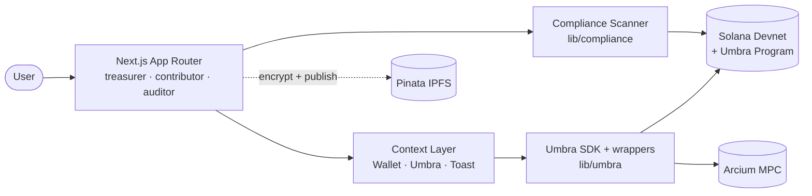

<div align="center">

  

  # Stealth — Documentation

  **Private payroll for modern DAOs on Solana — powered by the Umbra SDK.**

  *Encrypted by default. Auditable on demand.*

  [](https://nextjs.org)
  [](https://react.dev)
  [](https://www.typescriptlang.org)
  [](https://tailwindcss.com)
  [](https://solana.com)

</div>

---

This is the official documentation for **Stealth** — a privacy-first application for paying DAO contributors on Solana, with a real audit trail that satisfies modern compliance expectations.

The app is complete, runs locally, and talks directly to Solana devnet via the Umbra SDK. No hidden backend, no proprietary database — authoritative state lives on-chain and inside each user's wallet.

---

## Table of Contents

- [What is Stealth](#what-is-stealth)
- [The problem](#the-problem)
- [The approach](#the-approach)
- [Feature highlights](#feature-highlights)
- [Tech stack at a glance](#tech-stack-at-a-glance)
- [Architecture at a glance](#architecture-at-a-glance)
- [Running locally](#running-locally)
- [Documentation map](#documentation-map)

---

## What is Stealth

Stealth is a three-sided web application:

| Role | What they do |
|---|---|
| **Treasurer** | Sends bulk private payments to contributors via the Umbra mixer pool, and grants scoped audit access to third parties. |
| **Contributor** | Receives encrypted balances, claims UTXOs, withdraws to a public wallet, and publishes self-sovereign compliance reports via IPFS. |
| **Auditor** | Receives X25519 compliance grants, decrypts in-scope transactions, and exports certified PDF / CSV reports. |

Every role has its own pages, navigation, and flow. Identity is a wallet signature — no email, no password, no account to create.

---

## The problem

DAOs on Solana are stuck between two equally bad defaults:

1. **Full transparency** — tooling like Realms, Squads, or Streamflow is audit-friendly, but every contributor salary, vendor invoice, and burn-rate signal is publicly visible on Solscan forever.
2. **Full anonymity** — Tornado-style mixers protect privacy at the cost of auditability, which immediately triggers regulatory concerns (sanctions, AML, KYC).

No serious DAO actually wants 100% public or 100% anonymous. They want a third option: *private by default, auditable on demand.*

---

## The approach

Stealth leans on the cryptographic primitives Umbra already provides:

- **Encrypted Token Accounts** for contributor balances.
- **Mixer Pool UTXOs** for unlinkable sender-to-receiver transfers.
- **X25519 Compliance Grants** for scoped, time-bound auditor access — granularity ranges from master down to per-second.
- **Mixer Pool Viewing Keys** so auditors can decrypt the subset they were granted.

On top of those primitives, Stealth adds:

- **Bulk private payouts** via CSV upload.
- **Self-sovereign income reports** encrypted end-to-end and pinned to IPFS through Pinata.
- **A custom compliance scanner** that decodes Anchor event logs straight from Solana RPC.
- **Polished PDF and CSV exporters** with a report layout that holds up in front of regulators.

---

## Feature highlights

| Surface | Capabilities |
|---|---|
| **Landing page** | Hero, problem framing, how-it-works, Umbra section, feature grid, CTA, footer — animated with GSAP and IntersectionObserver |
| **Welcome page** | Role chooser with a GSAP-driven segmented control and per-role descriptions |
| **Treasurer** | Onboarding checklist (wallet → session → registration) and action cards for Pay / Manage Auditors |
| **Treasurer / Pay** | Inline SOL → WSOL wrap, CSV upload, recipient preview, bulk private send, per-row status |
| **Treasurer / Auditors** | Issue & revoke compliance grants, derive a Master Viewing Key, label grants, copy nonce |
| **Contributor / Balance** | Scan claimable UTXOs, claim per-UTXO, per-mint balances (SOL & USDC), withdraw with `callbackStatus` surfaced |
| **Contributor / Self-Sovereign Report** | Client-side AES-GCM encryption, IPFS publish, shared secret password for the auditor |
| **Auditor / Company Audits** | Active grants list, auditor address surface, copy-to-clipboard |
| **Auditor / Treasury Report** | Seven-file scanner pipeline, TVK descent, decrypted transaction list, PDF / CSV export |
| **Auditor / Individual Reports** | Sync from Pinata IPFS by auditor address, decrypt locally with the shared secret |
| **Global** | Two-pane RainbowKit-style wallet modal, role-aware guide tour, retro-CRT ConnectGate, account popover, toast system |

---

## Tech stack at a glance

- **Next.js 16.2.4** (App Router) + **React 19** + **TypeScript strict**
- **Tailwind CSS v4** with CSS-first `@theme inline`, no CSS-in-JS
- **Framer Motion** + **GSAP** for motion
- **@solana/wallet-adapter-react** plus explicit adapters (Solflare, Trust, Ledger, Torus) — Phantom & Backpack via Wallet Standard auto-detect
- **@umbra-privacy/sdk** v4, **@umbra-privacy/web-zk-prover**, **@umbra-privacy/umbra-codama**
- **@solana/kit** + **@solana/web3.js**
- **snarkjs**, **ffjavascript** for ZK proofs, **WebCrypto** for AES-GCM
- **Papaparse**, **jsPDF**, **Pinata IPFS**
- Deployed on **Vercel**, targeting **Solana devnet**

Full breakdown and rationale: [`FRONTEND_ARCHITECTURE.md`](./FRONTEND_ARCHITECTURE.md).

---

## Architecture at a glance



Full version with every module: [`FRONTEND_ARCHITECTURE.md`](./FRONTEND_ARCHITECTURE.md).

---

## Running locally

```bash
git clone https://github.com/Stefaron/Stealth-Frontier-Hackathon.git
cd Stealth-Frontier-Hackathon/stealth-fe

# Package manager: npm (see package-lock.json)
npm install
npm run dev
```

Open [http://localhost:3000](http://localhost:3000) in a browser that has a Solana wallet extension and some devnet SOL ([faucet](https://faucet.solana.com)).

Full setup, environment variables, Windows notes, and deployment: [`SETUP_GUIDE.md`](./SETUP_GUIDE.md).

---

## Documentation map

| File | Audience | Contents |
|---|---|---|
| [`README.md`](./README.md) | Everyone | This page — overview and map |
| [`PROJECT_OVERVIEW.md`](./PROJECT_OVERVIEW.md) | Product, founders, stakeholders | Background, value proposition, narrative user journey |
| [`FRONTEND_ARCHITECTURE.md`](./FRONTEND_ARCHITECTURE.md) | New engineers, reviewers | Folder layout, entry points, routing, state, styling |
| [`SETUP_GUIDE.md`](./SETUP_GUIDE.md) | Anyone running locally | Prerequisites, install, env, build, troubleshooting |
| [`FEATURES.md`](./FEATURES.md) | Product + engineering | Each feature, its flow, the files behind it |
| [`COMPONENTS.md`](./COMPONENTS.md) | Frontend engineers | Component inventory and how they relate |
| [`API_AND_DATA_FLOW.md`](./API_AND_DATA_FLOW.md) | Integration engineers | Pinata API routes, external services, sequence diagrams |
| [`DESIGN_SYSTEM.md`](./DESIGN_SYSTEM.md) | Designers + frontend | Color tokens, typography, layout, motion |
| [`DEVELOPMENT_NOTES.md`](./DEVELOPMENT_NOTES.md) | Maintainers | Conventions, recipes, improvement areas, known limits |

---

<div align="center">

  <br/>

  **Stealth** · Private by default · Auditable on demand

  [Repository](https://github.com/Stefaron/Stealth-Frontier-Hackathon) · [Umbra SDK](https://sdk.umbraprivacy.com/introduction) · [Main README](../README.md)

</div>
