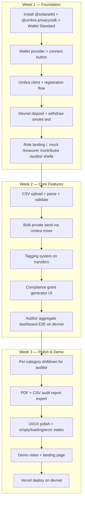

# stealth-fe

Frontend for **Stealth** — private payroll with built-in compliance for DAO auditors, built on the Umbra SDK for the Solana Frontier Hackathon 2026 (Umbra Side Track).

> Read this file before writing any code in `stealth-fe/`. For the product pitch, problem framing, architecture diagrams, and Umbra integration story, see the **root** [`../README.md`](../README.md). For project-wide rules and decisions, see [`../CLAUDE (2).md`](../CLAUDE%20%282%29.md).

---

## Table of contents

- [What this app is](#what-this-app-is)
- [Current state vs target state](#current-state-vs-target-state)
- [Tech stack (as actually installed)](#tech-stack-as-actually-installed)
- [Project conventions](#project-conventions)
- [Getting started](#getting-started)
- [Environment variables](#environment-variables)
- [Target file structure](#target-file-structure)
- [Routes plan](#routes-plan)
- [Umbra SDK integration plan](#umbra-sdk-integration-plan)
- [Implementation flow (3-week MVP)](#implementation-flow-3-week-mvp)
- [Definition of Done per feature](#definition-of-done-per-feature)
- [Out of scope (do NOT build)](#out-of-scope-do-not-build)
- [Caveats for AI assistants](#caveats-for-ai-assistants)

---

## What this app is

`stealth-fe` is the **single Next.js application** that serves all three Stealth user surfaces:

| Surface       | Route          | Owner                  | Why it exists                                                              |
| ------------- | -------------- | ---------------------- | -------------------------------------------------------------------------- |
| Treasurer UI  | `/treasurer`   | DAO admin / multisig   | Bulk private payroll, tagging, auditor grant management                    |
| Contributor UI| `/contributor` | Payroll recipient      | View encrypted earnings, withdraw to own wallet                            |
| Auditor UI    | `/auditor`     | Third-party audit firm | Scoped, decryptable view of DAO disbursements; PDF/CSV report export       |

There is **no separate backend service**. Authoritative state lives on-chain via Umbra; the Next.js server is used only for SSR, CSV parsing, and PDF generation.

---

## Current state vs target state

Be honest about where we are so the plan stays grounded.

### What exists today

- Default `create-next-app` scaffold (placeholder home page, Vercel logo).
- Next.js 16.2.4, React 19.2.4, Tailwind v4, TypeScript strict.
- `app/layout.tsx` with Geist fonts wired up.
- `app/page.tsx` is the unmodified template.
- `AGENTS.md` warning that this Next.js version has breaking changes vs training data — **read `node_modules/next/dist/docs/` before guessing API shape**.

### What does NOT exist yet (the work to do)

- All three role surfaces (`/treasurer`, `/contributor`, `/auditor`) — not even empty pages.
- Wallet adapter wiring (Wallet Standard for Phantom / Solflare).
- Umbra SDK install (`@umbra-privacy/sdk`) and the `lib/umbra/*` wrappers.
- `@solana/kit` install and any RPC client.
- CSV parsing (Papaparse) and bulk payment screen.
- Auditor compliance grant generator and dashboard.
- PDF/CSV report export.
- `.env.example`, `.env.local`, and any network config.

> Treat this section as the contract: when something here moves from "does NOT exist" to "exists," update both lists in the same PR.

---

## Tech stack (as actually installed)

This is what `package.json` actually says — it does **not** match the "Next.js 14" line in the older CLAUDE doc. Trust the lockfile, not the doc.

| Layer       | Tool                          | Version (locked) | Notes                                              |
| ----------- | ----------------------------- | ---------------- | -------------------------------------------------- |
| Framework   | `next`                        | 16.2.4           | App Router. Read `node_modules/next/dist/docs/`.   |
| UI          | `react` / `react-dom`         | 19.2.4           | React 19 — Server Components first.                |
| Language    | `typescript`                  | ^5               | `strict: true`.                                    |
| Styling     | `tailwindcss` + `@tailwindcss/postcss` | ^4      | Tailwind v4 — uses PostCSS plugin, not v3 config.  |
| Lint        | `eslint` + `eslint-config-next`| 16.2.4 / ^9     | `npm run lint`.                                    |
| Path alias  | `@/*` → `./*`                 | (tsconfig)       | Use `@/lib/...`, `@/components/...`.               |

### Will be added (planned, not yet installed)

| Purpose                   | Package                       | When                |
| ------------------------- | ----------------------------- | ------------------- |
| Solana TS client          | `@solana/kit`                 | Week 1              |
| Privacy primitives        | `@umbra-privacy/sdk`          | Week 1              |
| Wallet Standard           | `@wallet-standard/react` (or current Wallet Standard React bindings — confirm against Umbra docs) | Week 1 |
| CSV parsing               | `papaparse` + `@types/papaparse` | Week 2          |
| PDF export                | `@react-pdf/renderer` *or* `jspdf` (pick one) | Week 3 |
| Optional KV store         | `@vercel/kv` (only if needed) | If invite metadata needs persistence |

> Do **not** install Redux, Zustand, Express, NestJS, NextAuth, or any animation library. See the project-wide [`../CLAUDE (2).md`](../CLAUDE%20%282%29.md) §7 "Do NOT add."

---

## Project conventions

These are non-negotiable. Future contributors and AI assistants should be able to read any file and predict the rest.

- **TypeScript strict.** No `any` unless documented inline with a `// reason:` comment.
- **Server Components by default.** Drop to `"use client"` only for wallet/SDK code that needs browser APIs or user secrets.
- **No `useEffect` for data fetching.** Prefer Server Components. If client-side fetching is needed, use SWR or React Query.
- **One file per component.** PascalCase filenames (`AuditorDashboard.tsx`).
- **Hooks `useCamelCase`** (`useUmbraClient.ts`).
- **Utilities `camelCase`** (`parseCsvPayments.ts`).
- **Types/interfaces PascalCase** (`PaymentBatch`, `AuditScope`).
- **Constants SCREAMING_SNAKE_CASE.**
- **No prop drilling > 2 levels** — lift to context.
- **No premature `useMemo` / `useCallback`** — measure first.
- **No secrets in code.** All config in `.env.local`. Never commit env files.
- **No `console.log` in committed code.** Use a thin logger or strip.
- **Wallet signature is the auth.** No JWT, no session cookies, no NextAuth.
- **Privacy is the product.** Never log master seeds, never put viewing keys in URLs, never persist seeds to localStorage.

---

## Getting started

This project uses **npm** (a `package-lock.json` is committed). Don't switch to pnpm/yarn without removing the lockfile and updating CI.

### Prerequisites

- Node.js **20 LTS** or newer.
- npm 10+ (ships with Node 20).
- A Wallet Standard wallet — **Phantom** or **Solflare**.
- Devnet SOL — request from <https://faucet.solana.com>.

### Install and run

```bash
# from repo root
cd stealth-fe
npm install
npm run dev
```

App is served at <http://localhost:3000>.

### Available scripts

| Script         | What it does                          |
| -------------- | ------------------------------------- |
| `npm run dev`  | Next.js dev server with HMR.          |
| `npm run build`| Production build (`next build`).      |
| `npm run start`| Run the built app (`next start`).     |
| `npm run lint` | ESLint via `eslint-config-next`.      |

### Smoke check

After `npm run dev`, you should see the default Next.js placeholder. That confirms toolchain is healthy. From there, the next milestone is replacing `app/page.tsx` with the role-router landing (see [Routes plan](#routes-plan)).

---

## Environment variables

Create `stealth-fe/.env.local` (never commit this file). Use `.env.example` as the template — add it in the same PR that introduces the first SDK call.

```env
# Solana network
NEXT_PUBLIC_SOLANA_NETWORK=devnet
NEXT_PUBLIC_SOLANA_RPC_URL=https://api.devnet.solana.com

# Umbra SDK — resolves program ID by network
NEXT_PUBLIC_UMBRA_NETWORK=devnet

# Optional non-sensitive metadata store (only if used)
# KV_REST_API_URL=
# KV_REST_API_TOKEN=
```

Reference Umbra program IDs (the SDK picks these automatically by network — do **not** hardcode):

| Network | Umbra Program ID                              |
| ------- | --------------------------------------------- |
| Devnet  | `DSuKkyqGVGgo4QtPABfxKJKygUDACbUhirnuv63mEpAJ` |
| Mainnet | `UMBRAD2ishebJTcgCLkTkNUx1v3GyoAgpTRPeWoLykh` |

---

## Target file structure

This is the structure we are building toward. Folders should not be created empty — add a folder the same PR that adds the first file in it.

```
stealth-fe/
├── app/
│   ├── layout.tsx             # global shell, wallet provider
│   ├── page.tsx               # role landing (pick treasurer / contributor / auditor)
│   ├── treasurer/
│   │   ├── page.tsx           # workspace overview
│   │   ├── pay/page.tsx       # CSV upload + bulk private send
│   │   ├── auditors/page.tsx  # grant / revoke auditor scope
│   │   └── settings/page.tsx  # workspace, team, multisig connection
│   ├── contributor/
│   │   └── page.tsx           # encrypted earnings + withdraw
│   ├── auditor/
│   │   ├── page.tsx           # list of DAOs that granted access
│   │   └── [daoId]/page.tsx   # audit dashboard + drilldown + export
│   └── api/
│       └── (only if a server route is strictly needed)
├── components/
│   ├── ui/                    # buttons, inputs, table, dialog (shadcn/ui-style)
│   ├── treasurer/             # CsvDropzone, PaymentReviewTable, GrantScopePicker
│   ├── contributor/           # EncryptedBalanceCard, WithdrawDialog
│   └── auditor/               # AggregateMetrics, CategoryDrilldown, ReportExportButton
├── lib/
│   ├── umbra/                 # Umbra SDK wrappers (see plan below)
│   │   ├── client.ts
│   │   ├── registration.ts
│   │   ├── transfers.ts
│   │   ├── balance.ts
│   │   ├── compliance.ts
│   │   └── auditor.ts
│   ├── wallet/                # Wallet Standard provider, hooks, error mapping
│   ├── csv/                   # parseCsvPayments, validatePaymentRow
│   └── utils/                 # pure helpers
├── types/                     # PaymentBatch, AuditScope, ComplianceGrant, etc.
├── public/                    # static assets
└── (config files at root)
```

---

## Routes plan

Wallet identity gates each role — there is no login screen. The landing page lets the user pick a role; the role pages re-check that the connected wallet is appropriate (e.g., the auditor route requires at least one issued grant for that pubkey).

| Route                     | Renders                                | Auth check                                                                |
| ------------------------- | -------------------------------------- | ------------------------------------------------------------------------- |
| `/`                       | Role picker + connect wallet           | None                                                                      |
| `/treasurer`              | DAO list / workspace overview          | Wallet connected + Umbra registered                                       |
| `/treasurer/pay`          | CSV upload, review, sign batch         | Wallet connected + workspace selected                                     |
| `/treasurer/auditors`     | Grant / revoke auditor access          | Wallet connected + workspace selected                                     |
| `/treasurer/settings`     | Workspace + team + multisig            | Wallet connected + workspace selected                                     |
| `/contributor`            | Encrypted balance + withdraw           | Wallet connected + Umbra registered                                       |
| `/auditor`                | DAOs that granted me access            | Wallet connected; no grant = empty state with explainer                   |
| `/auditor/[daoId]`        | Aggregate / drilldown / export         | Wallet connected + valid grant for `daoId` (scope determines visibility)  |

---

## Umbra SDK integration plan

Each `lib/umbra/*` file owns one Umbra primitive. This isolates the SDK so the rest of the app stays boring.

| File                       | Umbra primitive                     | Surface that consumes it             |
| -------------------------- | ----------------------------------- | ------------------------------------ |
| `lib/umbra/client.ts`      | SDK client init, network resolve    | Everywhere                           |
| `lib/umbra/registration.ts`| `signMessage` master seed → register| First-time wallet flow (all roles)   |
| `lib/umbra/transfers.ts`   | Mixer Pool (UTXOs) — bulk transfer  | `/treasurer/pay`                     |
| `lib/umbra/balance.ts`     | Encrypted Token Account read        | `/contributor`                       |
| `lib/umbra/compliance.ts`  | X25519 Compliance Grants — issue/revoke | `/treasurer/auditors`            |
| `lib/umbra/auditor.ts`     | Mixer Pool Viewing Keys — scoped read | `/auditor/[daoId]`                 |

### Critical SDK behaviors to encode in these wrappers

- **Master seed derivation** comes from `wallet.signMessage(UMBRA_MESSAGE_TO_SIGN)`. Never modify the message string — it would invalidate every existing key. Re-derive per session; never persist.
- **Registration is a precondition.** All deposit / transfer / read flows must check registration status first and prompt registration if missing.
- **Encrypted balance ≠ on-chain balance.** Reading requires decryption with the master seed. Show clear "decrypting…" UI, not a stale 0.
- **MPC has latency.** Arcium computes off-chain; UX must show progress and handle retries.
- **Wallet feature gate.** Before anything, verify the connected wallet exposes both `solana:signTransaction` and `solana:signMessage`. If either is missing, fail fast with a human-readable error — do not silently degrade.

### Reference docs to read before implementing

- Quickstart — <https://sdk.umbraprivacy.com/quickstart>
- Wallet adapters — <https://sdk.umbraprivacy.com/sdk/wallet-adapters>
- Registration — <https://sdk.umbraprivacy.com/sdk/registration>
- Deposit — <https://sdk.umbraprivacy.com/sdk/deposit>
- Transfers — <https://sdk.umbraprivacy.com/sdk/transfers>
- Compliance — <https://sdk.umbraprivacy.com/sdk/compliance>
- Mixer overview — <https://sdk.umbraprivacy.com/sdk/mixer/overview>

If something is unclear, **read the docs**. The SDK is new (April 2026) and not in any model's training data. Do not invent method names.

---

## Implementation flow (3-week MVP)

This mirrors the project-wide plan in [`../CLAUDE (2).md`](../CLAUDE%20%282%29.md) §6 and breaks it into FE-shaped tasks. Build vertically — one feature working end-to-end before starting the next.



### Week 1 — Foundation

Goal: a wallet can connect, register with Umbra, deposit and withdraw on devnet. Role shells exist with mock data.

- [ ] Install: `@solana/kit`, `@umbra-privacy/sdk`, Wallet Standard React bindings.
- [ ] `lib/wallet/WalletProvider.tsx` — wallet context + Phantom/Solflare detection.
- [ ] `lib/umbra/client.ts` — single Umbra client, network from `NEXT_PUBLIC_UMBRA_NETWORK`.
- [ ] `lib/umbra/registration.ts` — `useUmbraRegistration` hook (status, register, error).
- [ ] `app/page.tsx` — role picker + connect wallet (replaces template).
- [ ] `app/treasurer/page.tsx`, `app/contributor/page.tsx`, `app/auditor/page.tsx` — empty shells with auth gating.
- [ ] Devnet smoke: deposit 1 USDC, read encrypted balance, withdraw. Capture working transaction signatures.
- [ ] Add `.env.example` with all `NEXT_PUBLIC_*` vars.

### Week 2 — Core Features

Goal: a treasurer can pay 10+ contributors privately from a CSV with tags, and an auditor with an aggregate grant can see the resulting summary.

- [ ] `lib/csv/parseCsvPayments.ts` — Papaparse + Zod-style validation.
- [ ] `components/treasurer/CsvDropzone.tsx` + `PaymentReviewTable.tsx`.
- [ ] `lib/umbra/transfers.ts` — bulk private send through mixer pool.
- [ ] Tagging UI — per-row category dropdown + free-text memo (sanitized).
- [ ] `lib/umbra/compliance.ts` — issue X25519 grant for an auditor pubkey + scope.
- [ ] `app/treasurer/auditors/page.tsx` — grant management UI.
- [ ] `lib/umbra/auditor.ts` — fetch aggregate view via mixer-pool viewing key.
- [ ] `app/auditor/[daoId]/page.tsx` — aggregate metrics card (total disbursement, recipient count, category breakdown).
- [ ] End-to-end run on devnet recorded as a working flow.

### Week 3 — Polish & Demo

Goal: per-category drilldown works, audit reports export as PDF + CSV, the UI looks production-grade, the app is deployed on Vercel pointed at devnet.

- [ ] `components/auditor/CategoryDrilldown.tsx` — per-category transactions for authorized scope.
- [ ] `lib/umbra/auditor.ts` — extend with per-category and full-detail queries.
- [ ] `components/auditor/ReportExportButton.tsx` — PDF (react-pdf or jsPDF) + CSV.
- [ ] Empty / loading / error / wallet-missing states for every screen.
- [ ] Sanctions screening status surfaced in aggregate view (data source can be a stub flagged as "TBD: integrate provider" until decided).
- [ ] Vercel deployment with `NEXT_PUBLIC_*` env vars.
- [ ] Demo video script (under 5 min) + recording.

---

## Definition of Done per feature

A feature is **not** merged until **all** of these hold:

1. Works end-to-end on Solana devnet against the real Umbra program.
2. TypeScript builds with `npm run build` (no `any` introduced without a `// reason:` comment).
3. ESLint passes (`npm run lint`).
4. Manual UX check: empty state, loading state, error state, success state all render correctly.
5. Wallet edge cases handled: not connected, wrong network, missing required wallet feature, user-rejected signature.
6. No secrets in code. No `console.log`. No master seeds in storage. No viewing keys in URLs.
7. Updates `stealth-fe/README.md` if the feature changes the user-visible flow, env vars, or routes.

---

## Out of scope (do NOT build)

These are explicitly **v2 or later**. If a teammate, AI assistant, or your past-self suggests them, push back.

- Contributor "proof of income" feature.
- Bank / landlord / consumer verifier flow.
- On-chain audit attestation by auditor.
- Mobile native app.
- Multi-DAO unified contributor view.
- Recurring / scheduled disbursements.
- Tax calculation per jurisdiction.
- On/off-ramp integration.
- Local currency display.
- Subscription tiers.
- Cross-chain support.
- DID integration.
- Custom in-house indexer (use the Umbra Indexer).

See [`../CLAUDE (2).md`](../CLAUDE%20%282%29.md) §6 for the canonical list.

---

## Caveats for AI assistants

If you (the model) are about to write code in this folder, read this section carefully — it will save a wasted PR.

1. **Next.js 16 ≠ Next.js 14.** The version installed here is 16.2.4. APIs, conventions, and file structure may differ from your training data. Read `node_modules/next/dist/docs/` (per [`AGENTS.md`](./AGENTS.md)) before guessing API shape. Heed deprecation notices.
2. **React 19 is current.** Server Components, Actions, the `use` hook, and the new ref-as-prop are all in scope. Do not paste React 18 patterns out of habit.
3. **Tailwind v4.** Uses `@tailwindcss/postcss`, not the v3 `tailwind.config.js`. Don't add v3 config files.
4. **Umbra SDK is post-training-cutoff (April 2026).** Never invent method names. Fetch the docs above before writing the first call.
5. **Auditor flow > Treasurer flow.** Most teams stop after the treasurer side. The auditor dashboard is what wins judging — prioritize accordingly.
6. **Devnet only for the MVP.** Mainnet flip is a config change, not a goal of the hackathon submission.
7. **Demos > features.** Every PR should make the demo measurably better. If it doesn't show in the 5-minute video, deprioritize.
8. **Privacy is the product.** Never log sensitive data, never embed viewing keys in URLs, never persist master seeds. If a code change risks any of these, stop and ask.

When in doubt, re-read the root [`../README.md`](../README.md) and [`../CLAUDE (2).md`](../CLAUDE%20%282%29.md). They are the source of truth for the product story; this file is the source of truth for *how the FE gets built*.
